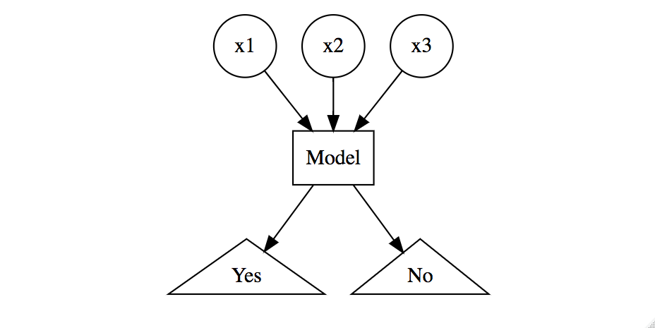

# (PART) Fundamentals {-} 

# Introduction to Machine Learning {#intro}

```{r setup-fundamentals, include=FALSE}
knitr::opts_chunk$set(
  echo = TRUE,
  fig.align = "center",
  message = FALSE,
  warning = FALSE,
  collapse = TRUE,
  cache = TRUE
)
```

Machine learning (ML) continues to grow in importance for many organizations across nearly all domains. Some example applications of machine learning in practice include:

* Predicting the likelihood of a patient returning to the hospital (_readmission_) within 30 days of discharge.
* Segmenting customers based on common attributes or purchasing behavior for targeted marketing.
* Predicting coupon redemption rates for a given marketing campaign.
* Predicting customer churn so an organization can perform preventative intervention.
* And many more!

In essence, these tasks all seek to learn from data.  To address each scenario, we can use a given set of _features_ to train an algorithm and extract insights. These algorithms, or _learners_, can be classified according to the amount and type of supervision needed during training.  The two main groups this book focuses on are: ___supervised learners___ which construct predictive models, and ___unsupervised learners___ which build descriptive models. Which type you will need to use depends on the learning task you hope to accomplish.


## Supervised learning

A ___predictive model___ is used for tasks that involve the prediction of a given output (or target) using other variables (or features) in the data set. Or, as stated by @apm [p. 2], predictive modeling is "...the process of developing a mathematical tool or model that generates an accurate prediction."  The learning algorithm in a predictive model attempts to discover and model the relationships among the <font color="red">target</font> variable (the variable being predicted) and the other <font color="blue">features</font> (aka predictor variables). Examples of predictive modeling include:

* using customer attributes to predict the probability of the customer churning in the next 6 weeks;
* using <font color="blue">home attributes</font> to predict the <font color="red">sales price</font>;
* using <font color="blue">employee attributes</font> to predict the likelihood of <font color="red">attrition</font>;
* using <font color="blue">patient attributes</font> and symptoms to predict the risk of <font color="red">readmission</font>;
* using <font color="blue">production attributes</font> to predict <font color="red">time to market</font>.

Each of these examples have a defined learning task; they each intend to use attributes ($X$) to predict an outcome measurement ($Y$).

```{block, type = "note"}
Throughout this text we'll use various terms interchangeably for:

- $X$: "predictor variables", "independent variables", "attributes", "features", "predictors"
- $Y$: "target variable", "dependent variable", "response", "outcome measurement"

```

The predictive modeling examples above describe what is known as _supervised learning_.  The supervision refers to the fact that the target values provide a supervisory role, which indicates to the learner the task it needs to learn. Specifically, given a set of data, the learning algorithm attempts to optimize a function (the algorithmic steps) to find the combination of feature values that results in a predicted value that is as close to the actual target output as possible.

```{block, type = "note"}
In supervised learning, the training data you feed the algorithm includes the target values.  Consequently, the solutions can be used to help _supervise_ the training process to find the optimal algorithm parameters.
```

Most supervised learning problems can be bucketed into one of two categories: _regression_ or _classification_, which we discuss next.

### Regression problems

When the objective of our supervised learning is to predict a numeric outcome, we refer to this as a ___regression problem___ (not to be confused with linear regression modeling).  Regression problems revolve around predicting output that falls on a continuum. In the examples above, predicting home sales prices and time to market reflect a regression problem because the output is numeric and continuous.  This means, given the combination of predictor values, the response value could fall anywhere along some continuous spectrum (e.g., the predicted sales price of a particular home could be between \$80,000 and \$755,000).  Figure \@ref(fig:regression-problem) illustrates average home sales prices as a function of two home features: year built and total square footage. Depending on the combination of these two features, the expected home sales price could fall anywhere along a plane.

```{r regression-problem, echo=FALSE, fig.cap="Average home sales price as a function of year built and total square footage.", fig.height=3, fig.width=3}

library(plotly)
df <- AmesHousing::make_ames()
x <- matrix(sort(df$Gr_Liv_Area)[floor(seq(1, nrow(df), length.out = 15))], 15, 1)
y <- matrix(sort(df$Year_Built)[floor(seq(1, nrow(df), length.out = 15))], 1, 15)
z <- 25051 + 3505*(log(x^.9) %*% log(y)) - 5*as.vector(x) 
c <- matrix(c(.92, .95, 1, 1, 1, 1, 1, 1, 1, 1, 1, 1, 1, 1, .95), 1, 15)
z <- sweep(z, MARGIN = 2, c, `*`)


# plot_ly(x = as.vector(x), y = as.vector(y), z = z, showscale = FALSE) %>%  
#     add_surface() %>%
#     layout(
#         scene = list(
#             xaxis = list(title = "Feature: square footage"),
#             yaxis = list(title = "Feature: year built"),
#             zaxis = list(title = "Response: sale price")
#         )
#     )

# code for 3D print version
par(mar = c(0.1, 0.1, 0.1, 0.1))  # remove extra white space
persp(
  x = x,
  y = y,
  z = z,
  xlab = "Square footage",
  ylab = "Year built",
  zlab = "Sale price",
  theta = -45,
  phi = 25,
  col = viridis::viridis(100)
)
```


### Classification problems

When the objective of our supervised learning is to predict a categorical outcome, we refer to this as a ___classification problem___.  Classification problems most commonly revolve around predicting a binary or multinomial response measure such as:

* Did a customer redeem a coupon (coded as yes/no or 1/0).
* Did a customer churn (coded as yes/no or 1/0).
* Did a customer click on our online ad (coded as yes/no or 1/0).
* Classifying customer reviews:
    * Binary: positive vs. negative.
    * Multinomial: extremely negative to extremely positive on a 0--5 Likert scale.
    
```{r classification-problem, echo=FALSE, out.width="75%", out.height="75%", fig.cap="Classification problem modeling 'Yes'/'No' response based on three features.", cache=FALSE}

## code to create graphic
#library(DiagrammeR)
# grViz("
#   
#   digraph boxes_and_circles {
#     node [shape = circle]
#     x1; x2; x3;
#     
#     node [shape = box]
#     Model;
#     
#     node [shape = triangle]
#     Yes; No;
# 
#     x1->Model; x2->Model; x3->Model; Model->No; Model->Yes;
# }")


```

However, when we apply machine learning models for classification problems, rather than predict a particular class (i.e., "yes" or "no"), we often want to predict the _probability_ of a particular class (i.e., yes: 0.65, no: 0.35).  By default, the class with the highest predicted probability becomes the predicted class.  Consequently, even though we are performing a classification problem, we are still predicting a numeric output (probability).  However, the essence of the problem still makes it a classification problem.

Although there are machine learning algorithms that can be applied to regression problems but not classification and vice versa, most of the supervised learning algorithms we cover in this book can be applied to both.  These algorithms have become the most popular machine learning applications in recent years. 


## Unsupervised learning

___Unsupervised learning___, in contrast to supervised learning, includes a set of statistical tools to better understand and describe your data, but performs the analysis without a target variable.  In essence, unsupervised learning is concerned with identifying groups in a data set. The groups may be defined by the rows (i.e., *clustering*) or the columns (i.e., *dimension reduction*); however, the motive in each case is quite different.

The goal of ___clustering___ is to segment observations into similar groups based on the observed variables; for example, to divide consumers into different homogeneous groups, a process known as market segmentation.  In __dimension reduction__, we are often concerned with reducing the number of variables in a data set. For example, classical linear regression models break down in the presence of highly correlated features.  Some dimension reduction techniques can be used to reduce the feature set to a potentially smaller set of uncorrelated variables. Such a reduced feature set is often used as input to downstream supervised learning models (e.g., principal component regression).

Unsupervised learning is often performed as part of an exploratory data analysis (EDA). However, the exercise tends to be more subjective, and there is no simple goal for the analysis, such as prediction of a response. Furthermore, it can be hard to assess the quality of results obtained from unsupervised learning methods. The reason for this is simple. If we fit a predictive model using a supervised learning technique (i.e., linear regression), then it is possible to check our work by seeing how well our model predicts the response _Y_ on observations not used in fitting the model. However, in unsupervised learning, there is no way to check our work because we don’t know the true answer---the problem is unsupervised!  

Despide its subjectivity, the importance of unsupervised learning should not be overlooked and such techniques are often used in organizations to: 

- Divide consumers into different homogeneous groups so that tailored marketing strategies can be developed and deployed for each segment.
- Identify groups of online shoppers with similar browsing and purchase histories, as well as items that are of particular interest to the shoppers within each group. Then an individual shopper can be preferentially shown the items in which he or she is particularly likely to be interested, based on the purchase histories of similar shoppers.
- Identify products that have similar purchasing behavior so that managers can manage them as product groups.

These questions, and many more, can be addressed with unsupervised learning.  Moreover, the outputs of an unsupervised learning models can be used as inputs to downstream supervised learning models.


## Roadmap

The goal of this book is to provide effective tools for uncovering relevant and useful patterns in your data by using R's ML stack. We begin by providing an overview of the ML modeling process and discussing fundamental concepts that will carry through the rest of the book. These include feature engineering, data splitting, model validation and tuning, and performance measurement. These concepts will be discussed in Chapters \@ref(process)-\@ref(engineering).

Chapters \@ref(linear-regression)-\@ref(svm) focus on common supervised learners ranging from simpler linear regression models to the more complicated gradient boosting machines and deep neural networks. Here we will illustrate the fundamental concepts of each base learning algorithm and how to tune its hyperparameters to maximize predictive performance.

Chapters \@ref(stacking)-\@ref(iml) delve into more advanced approaches to maximize effectiveness, efficiency, and interpretation of your ML models.  We discuss how to combine multiple models to create a stacked model (aka _super learner_), which allows you to combine the strengths from each base learner and further maximize predictive accuracy. We then illustrate how to make the training and validation process more efficient with automated ML (aka AutoML). Finally, we illustrate many ways to extract insight from your "black box" models with various ML interpretation techniques.

The latter part of the book focuses on unsupervised techniques aimed at reducing the dimensions of your data for more effective data representation (Chapters \@ref(pca)-\@ref(autoencoders)) and identifying common groups among your observations with clustering techniques (Chapters \@ref(kmeans)-\@ref(model-clustering)).


## The data sets {#data}

The data sets chosen for this book allow us to illustrate the different features of the presented machine learning algorithms.  Since the goal of this book is to demonstrate how to implement R's ML stack, we make the assumption that you have already spent significant time cleaning and getting to know your data via EDA. This would allow you to perform many necessary tasks prior to the ML tasks outlined in this book such as:

* Feature selection (i.e., removing unnecessary variables and retaining only those variables you wish to include in your modeling process).
* Recoding variable names and values so that they are meaningful and more interpretable.
* Recoding, removing, or some other approach to handling missing values.

Consequently, the exemplar data sets we use throughout this book have, for the most part, gone through the necessary cleaning processes. In some cases we illustrate concepts with stereotypical data sets (i.e. `mtcars`, `iris`, `geyser`); however, we tend to focus most of our discussion around the following data sets:

* Property sales information as described in @de2011ames.
    - __problem type__: supervised regression
    - __response variable__: `Sale_Price` (i.e., \$195,000, \$215,000)
    - __features__: 80 
    - __observations__: 2,930
    - __objective__: use property attributes to predict the sale price of a home
    - __access__: provided by the `AmesHousing` package [@R-ames]
    - __more details__: See `?AmesHousing::ames_raw`
    
    ```{r import-ames-data}
    # access data
    ames <- AmesHousing::make_ames()

    # initial dimension
    dim(ames)

    # response variable
    head(ames$Sale_Price)
    ```
    
    ```{block, type = "note"}
    You can see the entire data cleaning process to transform the raw Ames housing data (`AmesHousing::ames_raw`) to the final clean  data (`AmesHousing::make_ames`) that we will use in machine learning algorithms throughout this book at:

    https://github.com/topepo/AmesHousing/blob/master/R/make_ames.R

    ```
    
* Employee attrition information originally provided by [IBM Watson Analytics Lab](https://www.ibm.com/communities/analytics/watson-analytics-blog/hr-employee-attrition/).
    - __problem type__: supervised binomial classification
    - __response variable__: `Attrition` (i.e., "Yes", "No")
    - __features__: 30 
    - __observations__: 1,470
    - __objective__: use employee attributes to predict if they will attrit (leave the company)
    - __access__: provided by the `rsample` package [@R-rsample]
    - __more details__: See `?rsample::attrition`
    
    ```{r import-attrition-data}
    # access data
    attrition <- rsample::attrition

    # initial dimension
    dim(attrition)

    # response variable
    head(attrition$Attrition)
    ```    
    
* Image information for handwritten numbers originally presented to AT&T Bell Lab’s to help build automatic mail-sorting machines for the USPS. Has been used since early 1990s to compare machine learning performance on pattern recognition (i.e., @lecun1990handwritten; @lecun1998gradient; @cirecsan2012multi).
    - __Problem type__: supervised multinomial classification
    - __response variable__: `V785` (i.e., numbers to predict: 0, 1, ..., 9)
    - __features__: 784 
    - __observations__: 60,000 (train) / 10,000 (test)
    - __objective__: use attributes about the "darkness" of each of the 784 pixels in images of handwritten numbers to predict if the number is 0, 1, ..., or 9.
    - __access__: provided by the `dslabs` package [@R-dslabs]
    - __more details__: See `?dslabs::read_mnist()` and [online MNIST documentation](http://yann.lecun.com/exdb/mnist/)

    ```{r import-mnist-data, eval = FALSE}
    #access data
    mnist <- dslabs::read_mnist()
    names(mnist)
    ## [1] "train" "test"

    # initial feature dimensions
    dim(mnist$train$images)
    ## [1] 60000   784

    # response variable
    head(mnist$train$labels)
    ## [1] 5 0 4 1 9 2
    ```   

* Grocery items and quantities purchased. Each observation represents a single basket of goods that were purchased together.
    - __Problem type__: unsupervised basket analysis
    - __response variable__: NA
    - __features__: 42
    - __observations__: 2,000
    - __objective__: use attributes of each basket to identify common groupings of items purchased together.
    - __access__: available via additional online material

    ```{r import-mybasket-data}
    # access data
    my_basket <- readr::read_csv("data/my_basket.csv")

    # initial dimension
    dim(my_basket)

    # response variable
    my_basket
    ```   


