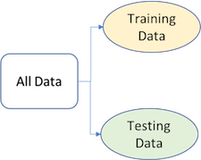

# Modeling Process {#process}

```{r setup-process, include=FALSE}
knitr::opts_chunk$set(
  echo = TRUE,
  fig.align = "center",
  message = FALSE,
  warning = FALSE,
  collapse = TRUE,
  cache = TRUE    
)

library(tidyverse)
# Set the graphical theme
theme_set(theme_light())
```

Much like EDA, the ML process is very iterative and heurstic-based. With minimal knowledge of the problem or data at hand, it is difficult to know which ML method will perform best.  This is known as the _no free lunch_\index{no free lunch} theorem for ML [@wolpert1996lack].  Consequently, it is common for many ML approaches to be applied, evaluated, and modified before a final, optimal model can be determined. Performing this process correctly provides great confidence in our outcomes. If not, the results will be useless and, potentially, damaging ^[See https://www.fatml.org/resources/relevant-scholarship for many discussions regarding implications of poorly applied and interpreted ML.]. 

Approaching ML modeling correctly means approaching it strategically by spending our data wisely on learning and validation procedures, properly pre-processing the feature and target variables, minimizing _data leakage_\index{data leakage} (Section \@ref(data-leakage)), tuning hyperparameters, and assessing model performance. Many books and courses portray the modeling process as a short sprint. A better analogy would be a marathon where many iterations of these steps are repeated before eventually finding the final optimal model. This process is illustrated in Figure \@ref(fig:02-modeling-process). Before introducing specific algorithms, this chapter, and the next, introduce concepts that are fundamental to the ML modeling process and that you’ll see briskly covered in future modeling chapters.

```{block, type = "note"}
Although the discussions in this chapter focuses on supervised ML modeling, many of the topics also apply to unsupervised methods.
```

```{r 02-modeling-process, echo=FALSE, out.height="90%", out.width="90%", fig.cap="General predictive machine learning process."}
knitr::include_graphics("images/modeling_process.png")
```

## Prerequisites

This chapter leverages the following packages.

```{r 02-pkg-prereqs}
# Helper packages
library(dplyr)     # for data manipulation
library(ggplot2)   # for awesome graphics

# Modeling process packages
library(rsample)   # for resampling procedures
library(caret)     # for resampling and model training
library(h2o)       # for resampling and model training

# h2o set-up 
h2o.no_progress()  # turn off h2o progress bars
h2o.init()         # launch h2o
```

To illustrate some of the concepts, we'll use the Ames Housing and employee attrition data sets introduced in Chapter \@ref(intro).  Throughout this book, we'll demonstrate approaches with ordinary R data frames.  However, since many of the supervised machine learning chapters leverage the __h2o__ package, we'll also show how to do some of the tasks with H2O objects.  You can convert any R data frame to an H2O object (i.e., import it to the H2O cloud) easily with `as.h2o(<my-data-frame>)`.  

```{block, type = "warning"}
If you try to convert the original `rsample::attrition` data set to an H2O object an error will occur. This is because several variables are _ordered factors_ and H2O has no way of handling this data type.  Consequently, you must convert any ordered factors to unordered; see `?base::ordered` for details.
```

```{r 02-load-data, create_data}
# ames data
ames <- AmesHousing::make_ames()
ames.h2o <- as.h2o(ames)

# attrition data
churn <- rsample::attrition %>% 
  mutate_if(is.ordered, factor, ordered = FALSE)
churn.h2o <- as.h2o(churn)
```


## Data splitting {#splitting}

A major goal of the machine learning process is to find an algorithm $f\left(X\right)$ that most accurately predicts future values ($\hat{Y}$) based on a set of features ($X$).  In other words, we want an algorithm that not only fits well to our past data, but more importantly, one that predicts a future outcome accurately.  This is called the ___generalizability___\index{generalizability} of our algorithm.  How we "spend" our data will help us understand how well our algorithm generalizes to unseen data.  

To provide an accurate understanding of the generalizability of our final optimal model, we can split our data into training and test data sets:

*  __Training set__: these data are used to develop feature sets, train our algorithms, tune hyperparameters, compare models, and all of the other activities required to choose a final model (e.g., the model we want to put into production).
*  __Test set__: having chosen a final model, these data are used to estimate an unbiased assessment of the model’s performance, which we refer to as the _generalization error_. 

```{block, type = "warning"}
It is critical that the test set not be used prior to selecting your final model. Assessing results on the test set prior to final model selection biases the model selection process since the testing data will have become part of the model development process.
```

```{r 02-split, echo=FALSE, fig.align='center', fig.cap="Splitting data into training and test sets."}

```

Given a fixed amount of data, typical recommendations for splitting your data into training-test splits include 60% (training)--40% (testing), 70%--30%, or 80%--20%. Generally speaking, these are appropriate guidelines to follow; however, it is good to keep the following points in mind:

* Spending too much in training (e.g., $>80\%$) won't allow us to get a good assessment of predictive performance.  We may find a model that fits the training data very well, but is not generalizable (_overfitting_).
* Sometimes too much spent in testing ($>40\%$) won't allow us to get a good assessment of model parameters.

Other factors should also influence the allocation proportions. For example, very large training sets (e.g., $n > 100\texttt{K}$) often result in only marginal gains compared to smaller sample sizes.  Consequently, you may use a smaller training sample to increase computation speed (e.g., models built on larger training sets often take longer to score new data sets in production).  In contrast, as $p \geq n$ (where $p$ represents the number of features), larger samples sizes are often required to identify consistent signals in the features.

The two most common ways of splitting data include ___simple random sampling___\index{simple random sampling} and ___stratified sampling___\index{stratified sampling}.


### Simple random sampling

The simplest way to split the data into training and test sets is to take a simple random sample. This does not control for any data attributes, such as the distribution your response variable ($Y$). There are multiple ways to split our data in R.  Here we show four options to produce a 70--30 split in the Ames housing data:

```{block, type = "note"}
Sampling is a random process so setting the random number generator with a common seed allows for reproducible results.  Throughout this book we'11 often use the seed `123` for reproducibility but the number itself has no special meaning.
```

```{r 02-splitting-applied}
# base R
set.seed(123)
index_1 <- sample(1:nrow(ames), round(nrow(ames) * 0.7))
train_1 <- ames[index_1, ]
test_1  <- ames[-index_1, ]

# caret package
set.seed(123)
index_2 <- createDataPartition(ames$Sale_Price, p = 0.7, list = FALSE)
train_2 <- ames[index_2, ]
test_2  <- ames[-index_2, ]

# rsample package
set.seed(123)
split_1  <- initial_split(ames, prop = 0.7)
train_3  <- training(split_1)
test_3   <- testing(split_1)

# h2o package
split_2 <- h2o.splitFrame(ames.h2o, ratios = 0.7, seed = 123)
train_4 <- split_2[[1]]
test_4  <- split_2[[2]]
```

With sufficient sample size, this sampling approach will typically result in a similar distribution of $Y$ (e.g., `Sale_Price` in the `ames` data) between your training and test sets, as illustrated below.

```{r distributions, echo=FALSE, fig.cap="Training (black) vs. test (red) response distribution.", fig.height=3, fig.width=9}
p1 <- ggplot(train_1, aes(x = Sale_Price)) + 
    geom_density(trim = TRUE) + 
    geom_density(data = test_1, trim = TRUE, col = "red") +
  ggtitle("Base R")

p2 <- ggplot(train_2, aes(x = Sale_Price)) + 
    geom_density(trim = TRUE) + 
    geom_density(data = test_2, trim = TRUE, col = "red") +
    theme(axis.title.y = element_blank(),
          axis.ticks.y = element_blank(),
          axis.text.y = element_blank()) +
    ggtitle("caret") 

p3 <- ggplot(train_3, aes(x = Sale_Price)) + 
    geom_density(trim = TRUE) + 
    geom_density(data = test_3, trim = TRUE, col = "red") +
    theme(axis.title.y = element_blank(),
          axis.ticks.y = element_blank(),
          axis.text.y = element_blank()) +
    ggtitle("rsample")

p4 <- ggplot(as.data.frame(train_4), aes(x = Sale_Price)) + 
    geom_density(trim = TRUE) + 
    geom_density(data = as.data.frame(test_4), trim = TRUE, col = "red") +
    theme(axis.title.y = element_blank(),
          axis.ticks.y = element_blank(),
          axis.text.y = element_blank()) +
    ggtitle("h2o")

gridExtra::grid.arrange(p1, p2, p3, p4, nrow = 1)
```

### Stratified sampling {#stratified}

If we want to explicitly control the sampling so that our training and test sets have similar $Y$ distributions, we can use stratified sampling.  This is more common with classification problems where the response variable may be severely imbalanced (e.g., 90% of observations with response "Yes" and 10% with response "No"). However, we can also apply stratified sampling to regression problems for data sets that have a small sample size and where the response variable deviates strongly from normality (i.e., positively skewed like `Sale_Price`).  With a continuous response variable, stratified sampling will segment $Y$ into quantiles and randomly sample from each.  Consequently, this will help ensure a balanced representation of the response distribution in both the training and test sets.

The easiest way to perform stratified sampling on a response variable is to use the __rsample__ package, where you specify the response variable to `strata`fy. The following illustrates that in our original employee attrition data we have an imbalanced response (No: 84%, Yes: 16%). By enforcing stratified sampling, both our training and testing sets have approximately equal response distributions. 

```{r stratified sampling}
# orginal response distribution
table(churn$Attrition) %>% prop.table()

# stratified sampling with the rsample package
set.seed(123)
split_strat  <- initial_split(churn, prop = 0.7, strata = "Attrition")
train_strat  <- training(split_strat)
test_strat   <- testing(split_strat)

# consistent response ratio between train & test
table(train_strat$Attrition) %>% prop.table()
table(test_strat$Attrition) %>% prop.table()
```

### Class imbalances

Imbalanced data can have a significant impact on model predictions and performance [@apm].  Most often this involves classification problems where one class has a very small proportion of observations (e.g., defaults - 5% versus nondefaults - 95%). Several sampling methods have been developed to help remedy class imbalance and most of them can be categorized as either _up-sampling_\index{up-sampling} or _down-sampling_\index{down-sampling}.

Down-sampling balances the dataset by reducing the size of the abundant class(es) to match the frequencies in the least prevalent class. This method is used when the quantity of data is sufficient. By keeping all samples in the rare class and randomly selecting an equal number of samples in the abundant class, a balanced new dataset can be retrieved for further modeling. Furthermore, the reduced sample size reduces the computation burden imposed by further steps in the ML process.

On the contrary, up-sampling is used when the quantity of data is insufficient. It tries to balance the dataset by increasing the size of rarer samples. Rather than getting rid of abundant samples, new rare samples are generated by using repetition or bootstrapping (described further in Section \@ref(bootstrapping)).

Note that there is no absolute advantage of one sampling method over another. Application of these two methods depends on the use case it applies to and the data set itself. A combination of over- and under-sampling is often successful and a common approach is known as Synthetic Minority Over-Sampling Technique, or SMOTE [@chawla2002smote].  This alternative sampling approach, as well as others, can be implemented in R (see the `sampling` argument in `?caret::trainControl()`).  Furthermore, many ML algorithms implemented in R have class weighting schemes to remedy imbalances internally (e.g., most __h2o__ algorithms have a `weights_column` and `balance_classes` argument).


## Creating models in R

The R ecosystem provides a wide variety of ML algorithm implementations. This makes many powerful algorithms available at your fingertips. Moreover, there are almost always more than one package to perform each algorithm (e.g., there are over 20 packages for fitting random forests). There are pros and cons to this wide selection; some implementations may be more computationally efficient while others may be more flexible (i.e., have more hyperparameter tuning options). Future chapters will expose you to many of the packages and algorithms that perform and scale best to the kinds of tabular data and problems encountered by most organizations.

However, this also has resulted in some drawbacks as there are inconsistencies in how algorithms allow you to define the formula of interest and how the results and predictions are supplied. In addition to illustrating the more popular and powerful packages, we'll also show you how to use implementations that provide more consistency.

### Many formula interfaces

To fit a model to our data, the model terms must be specified. Historically, there are two main interfaces for doing this. The formula interface using R formula rules to specify a symbolic representation of the terms. For example, `Y ~ X` where we say "Y is a function of X". To illustrate, suppose we have some generic modeling function called `model_fn()` which accepts an R formula, as in the following examples:

```{r formula-interface, eval=FALSE}
# sale price as a function of neighborhood and year sold
model_fn(Sale_Price ~ Neighborhood + Year_Sold, data = ames)

# Variables + interactions
model_fn(Sale_Price ~ Neighborhood + Year_Sold + 
           Neighborhood:Year_Sold, data = ames)

# Shorthand for all predictors
model_fn(Sale_Price ~ ., data = ames)

# Inline functions / transformations
model_fn(log10(Sale_Price) ~ ns(Longitude, df = 3) + 
           ns(Latitude, df = 3), data = ames)
```

This is very convenient but it has some disadvantages. For example:

- You can't nest in-line functions such as performing principal components analysis on the feature set prior to executing the model (`model_fn(y ~ pca(scale(x1), scale(x2), scale(x3)), data = df)`).
- All the model matrix calculations happen at once and can't be recycled when used in a model function.
- For very wide data sets, the formula method can be extremely inefficient [@kuhnFormula].
- There are limited roles that variables can take which has led to several re-implementations of formulas.
- Specifying multivariate outcomes is clunky and inelegant.
- Not all modeling functions have a formula method (lack of consistency!).

Some modeling functions have a non-formula (XY) interface. These functions have separate arguments for the predictors and the outcome(s):

```{r non-forumal-interface, eval=FALSE}
# use separate inputs for X and Y
features <- c("Year_Sold", "Longitude", "Latitude")
model_fn(x = ames[, features], y = ames$Sale_Price)
```

This provides more efficient calculations but can be inconvenient if you have transformations, factor variables, interactions, or any other operations to apply to the data prior to modeling.

Overall, it is difficult to determine if a package has one or both of these interfaces. For example, the `lm()` function, which performs linear regression, only has the formula method. Consequently, until you are familiar with a particular implementation you will need to continue referencing the corresponding help documentation.

A third interface, is to use _variable name specification_ where we provide all the data combined in one training frame but we specify the features and response with character strings.  This is the interface used by the __h2o__ package.

```{r name-interface, eval=FALSE}
model_fn(
  x = c("Year_Sold", "Longitude", "Latitude"),
  y = "Sale_Price",
  data = ames.h2o
  )
```

One approach to get around these inconsistencies is to use a meta engine, which we discuss next.

### Many engines

Although there are many individual ML packages available, there is also an abundance of meta engines that can be used to help provide consistency.  For example, the following all produce the same linear regression model output:

```{r many-engines, eval=FALSE}
lm_lm    <- lm(Sale_Price ~ ., data = ames)
lm_glm   <- glm(Sale_Price ~ ., data = ames, family = gaussian)
lm_caret <- train(Sale_Price ~ ., data = ames, method = "lm")
```

Here, `lm()` and `glm()` are two different algorithm engines that can be used to fit the linear model and `caret::train()` is a meta engine (aggregator) that allows you to apply almost any direct engine with `method = "<method-name>"`. There are trade-offs to consider when using direct versus meta engines. For example, using direct engines can allow for extreme flexibility but also requires you to familiarize yourself with the unique differences of each implementation. For example, the following highlights the various syntax nuances required to compute and extract predicted class probabilities across different direct engines.^[This table was modified from @kuhnMLtraining2019]

| Algorithm | Package | Code |
| --------- | ------- | ------------- |
| Linear discriminant analysis | __MASS__ | `predict(obj)` |
| Generalized linear model |	__stats__	| `predict(obj, type = "response")` |
| Mixture discriminant analysis |	__mda__	|	`predict(obj, type = "posterior")` |
| Decision tree |	__rpart__	|	`predict(obj, type = "prob")` |
| Random Forest |	__ranger__ |	`predict(obj)$predictions` |
| Gradient boosting machine |	__gbm__ |	`predict(obj, type = "response", n.trees)` |

Table: Table 1: Syntax for computing predicted class probabilities with direct engines.

Meta engines provide you with more consistency in how you specify inputs and extract outputs but can be less flexible than direct engines. Future chapters will illustrate both approaches. For meta engines, we'll focus on the __caret__ package in the hardcopy of the book while also demonstrating the newer __parsnip__ package in the additional online resources.^[The __caret__ package has been the preferred meta engine over the years; however, the author is now transitioning to fulltime development on __parsnip__, which is designed to be a more robust and tidy meta engine.] 

## Resampling methods {#resampling}

In section \@ref(splitting) we split our data into training and testing sets. Furthermore, we were very explicit about the fact that we ___do not___ use the test set to assess model performance during the training phase. So how do we assess the generalization performance of the model? 

One option is to assess an error metric based on the training data. Unfortunately, this leads to biased results as some models can perform very well on the training data but not generalize well to a new data set (we'll illustrate this in Section \@ref(bias-var)). 

A second method is to use a _validation_\index{validation} approach, which involves splitting the training set further to create two parts (as in Section \@ref(splitting)): a training set and a validation set (or _holdout set_).  We can then train our model(s) on the new training set and estimate the performance on the validation set. Unfortunately, validation using a single holdout set can be highly variable and unreliable unless you are working with very large data sets [@molinaro2005prediction; @hawkins2003assessing]. As the size of your data set reduces, this concern increases.

```{block, type = "note"}
Although we stick to our definitions of test, validation, and holdout sets, these terms are sometimes used interchangeably in other literature and software. What's important to remember is to always put a portion of the data under lock and key until a final model has been selected (we refer to this as the test data, but others refer to it as the holdout set).
```

__Resampling methods__\index{resampling methods} provide an alternative approach by allowing us to repeatedly fit a model of interest to parts of the training data and testing the performance on other parts.  The two most commonly used resampling methods include _k-fold cross validation_\index{k-fold cross validation} and _bootstrapping_\index{bootstrapping}.  

### _k_-fold cross validation

_k_-fold cross-validation (aka _k_-fold CV) is a resampling method that randomly divides the training data into _k_ groups (aka folds) of approximately equal size. The model is fit on $k-1$ folds and then the remaining fold is used to compute model performance.  This procedure is repeated _k_ times; each time, a different fold is treated as the validation set. This process results in _k_ estimates of the generalization error (say $\epsilon_1, \epsilon_2, \dots, \epsilon_k$). Thus, the _k_-fold CV estimate is computed by averaging the _k_ test errors, providing us with an approximation of the error we might expect on unseen data.

```{r 02-cv, echo=FALSE, fig.cap="Illustration of the k-fold cross validation process.", out.width='90%', out.height='90%'}
knitr::include_graphics("images/cv.png")
```

Consequently, with _k_-fold CV, every observation in the training data will be held out one time to be included in the test set as illustrated in Figure \@ref(fig:crossv).  In practice, one typically uses $k = 5$ or $k = 10$. There is no formal rule as to the size of _k_; however, as _k_ gets larger, the difference between the estimated performance and the true performance to be seen on the test set will decrease.  On the other hand, using too large of _k_ can introduce computational burdens.  Moreover, @molinaro2005prediction found that $k=10$ performed similarly to leave-one-out cross validation (LOOCV) which is the most extreme approach (i.e., setting $k = n$).

```{r crossv, echo=FALSE, fig.width=9, fig.height=4, fig.cap="10-fold cross validation on 32 observations. Each observation is used once for validation and nine times for training."}
cv <- vfold_cv(mtcars, 10)

cv_plot <- cv$splits %>%
  map2_dfr(seq_along(cv$splits), ~ mtcars %>% mutate(
    Resample = paste0("Fold_", str_pad(.y, 2, pad = 0)),
    ID = row_number(),
    Data = ifelse(ID %in% .x$in_id, "Training", "Validation"))
    ) %>%
  ggplot(aes(Resample, ID, fill = Data)) +
  geom_tile() +
  scale_fill_manual(values = c("#f2f2f2", "#AAAAAA")) +
  scale_y_reverse("Observation ID", breaks = 1:nrow(mtcars), expand = c(0, 0)) +
  scale_x_discrete(NULL, expand = c(0, 0)) +
  theme_classic() +
  theme(legend.title=element_blank())

cv_plot
```

Although using $k \geq 10$ helps to minimize the variability in the estimated performance, _k_-fold CV still tends to have higher variability than bootstrapping (discussed next).  @kim2009estimating showed that repeating _k_-fold CV can help to increase the precision of the estimated generalization error.  Consequently, for smaller data sets (say $n < 10,000$), 10-fold CV repeated 5 or 10 times will improve the accuracy of your estimated performance and also provide an estimate of its variability.

Throughout this book we'll cover multiple ways to incorporate CV as you can often perform CV directly within certain ML functions:

```{r direct-cv, eval=FALSE}
# example in h2o
h2o.cv <- h2o.glm(
  x = x, 
  y = y, 
  training_frame = ames.h2o,
  nfolds = 10  # perform 10-fold CV
)
```

Or externally as in the below chunk^[`rsample::vfold_cv()` results in a nested data frame where each element in `splits` is a list containing the training data frame and the observation IDs that will be used for training the model vs. model validation.].  When applying it externally to an ML algorithm as below,  we'll need a process to apply the ML model to each resample, which we'll also cover.

```{r rsample-resample}
vfold_cv(ames, v = 10)
```


### Bootstrapping {#bootstrapping}

A bootstrap sample is a random sample of the data taken _with replacement_ [@efron1986bootstrap].  This means that, after a data point is selected for inclusion in the subset, it's still available for further selection. A bootstrap sample is the same size as the original data set from which it was constructed. Figure \@ref(fig:bootstrapscheme) provides a schematic of bootstrap sampling where each bootstrap sample contains 12 observations just as in the original data set. Furthermore, bootstrap sampling will contain approximately the same distribution of values (represented by colors) as the original data set.

```{r bootstrapscheme, echo=FALSE, out.width='70%', out.height='70%', fig.cap="Illustration of the bootstrapping process."}
knitr::include_graphics("images/bootstrap-scheme.png")
```

Since samples are drawn with replacement, each bootstrap sample is likely to contain duplicate values. In fact, on average, $\approx 63.21$% of the original sample ends up in any particular bootstrap sample. The original observations not contained in a particular bootstrap sample are considered _out-of-bag_ (OOB). When bootstrapping, a model can be built on the selected samples and validated on the OOB samples; this is often done, for example, in random forests (\@ref(random-forest)).

Since observations are replicated in bootstrapping, there tends to be less variability in the error measure compared with _k_-fold CV [@efron1983estimating]. However, this can also increase the bias of your error estimate.  This can be problematic with smaller data sets; however, for most average-to-large data sets (say $n \geq 1,000$) this concern is often negligable. 

Figure \@ref(fig:sampling-comparison) compares bootstrapping to 10-fold CV on a small data set with $n = 32$ observations. A thorough introduction to the bootstrap and its use in R is provided in @davison1997bootstrap.

```{r sampling-comparison, echo=FALSE, fig.width=12, fig.height=5.5, fig.cap="Bootstrap sampling (left) versus 10-fold cross validation (right) on 32 observations. For bootstrap sampling, the observations that have zero replications (white) are the out-of-bag observations used for validation."}
boots <- rsample::bootstraps(mtcars, 10)

boots_plot <- boots$splits %>%
  map2_dfr(seq_along(boots$splits), ~ mtcars %>% 
             mutate(
               Resample = paste0("Bootstrap_", str_pad(.y, 2, pad = 0)),
               ID = row_number()
             ) %>%
             group_by(ID) %>%
             mutate(Replicates = factor(sum(ID == .x$in_id)))) %>%
  ggplot(aes(Resample, ID, fill = Replicates)) +
  geom_tile() +
  scale_fill_manual(values = c("#FFFFFF", "#F5F5F5", "#C8C8C8", "#A0A0A0", "#707070", "#505050", "#000000")) +
  scale_y_reverse("Observation ID", breaks = 1:nrow(mtcars), expand = c(0, 0)) +
  scale_x_discrete(NULL, expand = c(0, 0)) +
  theme_classic() +
  theme(axis.text.x = element_text(angle = 90, hjust = 1)) +
  ggtitle("Bootstrap sampling") 

cv_plot <- cv_plot + 
  ggtitle("10-fold cross validation") +
  theme(axis.text.x = element_text(angle = 90, hjust = 1))

cowplot::plot_grid(boots_plot, cv_plot, align = "h", nrow = 1)
```

We can create bootstrap samples easily with `rsample::bootstraps()`;

```{r create-bootstraps}
bootstraps(ames, times = 10)
```

Bootstrapping is, typically, more of an internal resampling procedure that is naturally built into certain ML algorithms.  This will become more apparent in the bagging and random forest chapters (\@ref(bagging)-\@ref(random-forest)).

### Alternatives

Its important to note that there are other useful resampling procedures. If you're working with time-series specific data then you will want to incorporate rolling origin and other time series resampling procedures. @hyndman2018forecasting is the dominant, R-focused, time series resource^[See their open source book at https://www.otexts.org/fpp2].

Additionally, @efron1983estimating developed the "632 method" and @efron1997improvements discuss the "632+ method"; both approaches seek to minimize biases experienced with bootstrapping on smaller data sets and are available via __caret__ (see `?caret::trainControl` for details).

## Bias variance trade-off {#bias-var}

Prediction errors can be decomposed into two important subcomponents: error due to "bias" and error due to "variance". There is often a tradeoff between a model's ability to minimize bias and variance. Understanding how different sources of error lead to bias and variance helps us improve the data fitting process resulting in more accurate models.\index{bias variance trade-off}

### Bias

_Bias_\index{bias} is the difference between the expected (or average) prediction of our model and the correct value which we are trying to predict. It measures how far off in general a model's predictions are from the correct value, which provides a sense of how well a model can conform to the underlying structure of the data. Figure \@ref(fig:bias-model) illustrates an example where the polynomial model does not capture the underlying structure well.  Linear models are classical examples of high bias models as they are less flexible and rarely capture non-linear, non-monotonic relationships. 

We also need to think of bias-variance in relation to resampling.  Models with high bias are rarely effected by the noise introduced by resampling. If a model has high bias, it will have consistency in its resampling performance as illustrated by Figure \@ref(fig:bias-model).

```{r bias-model, echo=FALSE, fig.height=4, fig.width=10, fig.cap="A biased polynomial model fit to a single data set does not capture the underlying non-linear, non-monotonic data structure (left).  Models fit to 25 bootstrapped replicates of the data are underterred by the noise and generates similar, yet still biased, predictions (right)."}
# Simulate some nonlinear monotonic data
set.seed(123)  # for reproducibility
x <- seq(from = 0, to = 2 * pi, length = 500)
y <- sin(x) + rnorm(length(x), sd = 0.3)
df <- data.frame(x, y) %>%
  filter(x < 4.5)

# single model fit
bias_model <- lm(y ~ I(x^3), data = df)
df$predictions <- predict(bias_model, df)

p1 <- ggplot(df, aes(x, y)) +
  geom_point(alpha = .3) +
  geom_line(aes(x, predictions), size = 1.5, color = "dodgerblue") +
  scale_y_continuous("Response", limits = c(-1.75, 1.75), expand = c(0, 0)) +
  scale_x_continuous(limits = c(0, 4.5), expand = c(0, 0)) +
  ggtitle("Single biased model fit")

# bootstrapped model fit
bootstrap_n <- 25
bootstrap_results <- NULL
for(i in seq_len(bootstrap_n)) {
  # reproducible sampled data frames
  set.seed(i)
  index <- sample(seq_len(nrow(df)), nrow(df), replace = TRUE)
  df_sim <- df[index, ]
  
  # fit model and add predictions to results data frame
  fit <- lm(y ~ I(x^3), data = df_sim)
  df_sim$predictions <- predict(fit, df_sim)
  df_sim$model <- paste0("model", i)
  df_sim$ob <- index
  bootstrap_results <- rbind(bootstrap_results, df_sim)
}

p2 <- ggplot(bootstrap_results, aes(x, predictions, color = model)) +
  geom_line(show.legend = FALSE, size = .5) +
  scale_y_continuous("Response", limits = c(-1.75, 1.75), expand = c(0, 0)) +
  scale_x_continuous(limits = c(0, 4.5), expand = c(0, 0)) +
  ggtitle("25 biased models fit to bootstrap samples")

gridExtra::grid.arrange(p1, p2, nrow = 1)
```

### Variance

On the other hand, error due to _variance_\index{variance} is defined as the variability of a model prediction for a given data point. Many models (e.g., _k_-nearest neighbor, decision trees, gradient boosting machines) are very adaptable and offer extreme flexibility in the patterns that they can fit to.  However, these models offer their own problems as they run the risk of overfitting to the training data.  Although you may achieve very good performance on your training data, the model will not automatically generalize well to unseen data.

```{r variance-model, echo=FALSE, fig.height=4, fig.width=10, fig.cap="A high variance k-nearest neighbor model fit to a single data set captures the underlying non-linear, non-monotonic data structure well but also overfits to individual data points (left).  Models fit to 25 bootstrapped replicates of the data are deterred by the noise and generate highly variable predictions (right)."}
# Simulate some nonlinear monotonic data
set.seed(123)  # for reproducibility
x <- seq(from = 0, to = 2 * pi, length = 500)
y <- sin(x) + rnorm(length(x), sd = 0.3)
df <- data.frame(x, y) %>%
  filter(x < 4.5)

# single model fit
variance_model <- knnreg(y ~ x, k = 3, data = df)
df$predictions <- predict(variance_model, df)

p1 <- ggplot(df, aes(x, y)) +
  geom_point(alpha = .3) +
  geom_line(aes(x, predictions), size = 1.5, color = "dodgerblue") +
  scale_y_continuous("Response", limits = c(-1.75, 1.75), expand = c(0, 0)) +
  scale_x_continuous(limits = c(0, 4.5), expand = c(0, 0)) +
  ggtitle("Single high variance model fit")

# bootstrapped model fit
bootstrap_n <- 25
bootstrap_results <- NULL
for(i in seq_len(bootstrap_n)) {
  # reproducible sampled data frames
  set.seed(i)
  index <- sample(seq_len(nrow(df)), nrow(df), replace = TRUE)
  df_sim <- df[index, ]
  
  # fit model and add predictions to results data frame
  fit <- knnreg(y ~ x, k = 3, data = df_sim)
  df_sim$predictions <- predict(fit, df_sim)
  df_sim$model <- paste0("model", i)
  df_sim$ob <- index
  bootstrap_results <- rbind(bootstrap_results, df_sim)
}

p2 <- ggplot(bootstrap_results, aes(x, predictions, color = model)) +
  geom_line(show.legend = FALSE) +
  scale_y_continuous("Response", limits = c(-1.75, 1.75), expand = c(0, 0)) +
  scale_x_continuous(limits = c(0, 4.5), expand = c(0, 0)) +
  ggtitle("25 high variance models fit to bootstrap samples")

gridExtra::grid.arrange(p1, p2, nrow = 1)

```

Since high variance models are more prone to overfitting, using resampling procedures are critical to reduce this risk.  Moreover, many algorithms that are capable of achieving high generalization performance have lots of _hyperparameters_\index{hyperparameters} that control the level of model complexity (i.e., the tradeoff between bias and variance).

### Hyperparameter tuning {#tune-overfit}

Hyperparameters (aka _tuning parameters_) are the "knobs to twiddle"^[This phrase comes from Brad Efron's comments in @breiman2001statistical] to control the complexity of machine learning algorithms and, therefore, the bias-variance trade-off.  Not all algorithms have hyperparameters (e.g., ordinary least squares^[At least in the ordinary sense. You could think of polynomial regression as having a single hyperparamer: the degree of the polynomial.]); however, most have at least one or more. 

The proper setting of these hyperparameters are often dependent on the data and problem at hand and cannot always be estimated by the training data alone. Consequently, we need a method of identifying the optimal setting.  For example, in the high variance example in the previous section, we illustrated a high variance _k_-nearest neighbor model (we'll discuss _k_-nearest neighbor in Chapter \@ref(knn)).  _k_-nearest neighbor models have a single hyperparameter (_k_) that determines the predicted value to be made based on the _k_ nearest observations in the training data to the one being predicted.  If _k_ is small (e.g., $k=3$), the model will make a prediction for a given observation based on the average of the response values for the 3 observations in the training data most similar to the observation being predicted.  This often results in highly variable predicted values because we are basing the prediction (in this case, an average) on a very small subset of the training data.  As _k_ gets bigger, we base our predictions on an average of a larger subset of the training data, which naturally reduces the variance in our predicted values (remember this for later, averaging reduces variance!). Figure \@ref(fig:knn-options) illustrates this point.  Smaller _k_ values (e.g., 2, 5, or 10) lead to high variance (but lower bias) and larger values (e.g., 150) lead to high bias (but lower variance). The optimal _k_ value might exist somewhere between 20--50, but how do we know which value of _k_ to use?

```{r knn-options, fig.width=10, echo=FALSE, fig.cap="k-nearest neighbor model with differing values for k."}
k_results <- NULL
k <- c(2, 5, 10, 20, 50, 150)
# fit many different models
for(i in seq_along(k)) {
  df_sim <- df
  fit <- knnreg(y ~ x, k = k[i], data = df_sim)
  df_sim$predictions <- predict(fit, df_sim)
  df_sim$model <- paste0("k = ", str_pad(k[i], 3, pad = " "))
  k_results <- rbind(k_results, df_sim)
}

ggplot() +
  geom_point(data = df, aes(x, y), alpha = .3) +
  geom_line(data = k_results, aes(x, predictions), color = "dodgerblue", size = 1.5) +
  scale_y_continuous("Response", limits = c(-1.75, 1.75), expand = c(0, 0)) +
  scale_x_continuous(limits = c(0, 4.5), expand = c(0, 0)) +
  facet_wrap(~ model)
```

One way to perform hyperparameter tuning is to fiddle with hyperparameters manually until you find a great combination of hyperparameter values that result in high predictive accuracy (as measured using _k_-fold CV, for instance). However, this can be very tedious work depending on the number of hyperparameters. An alternative approach is to perform a _grid search_\index{grid search}. A grid search is an automated approach to searching across many combinations of hyperparameter values.  

For our _k_-nearest neighbor example, a grid search would predefine a candidate set of values for _k_ (e.g., $k = 1, 2, \dots, j$) and perform a resampling method (e.g., _k_-fold CV) to estimate which _k_ value generalizes the best to unseen data.  Figure \@ref(fig:knn-tune) illustrates the results from a grid search to assess $k = 2, 12, 14, \dots, 150$ using repeated 10-fold CV. The error rate displayed represents the average error for each value of _k_ across all the repeated CV folds. On average, $k=46$ was the optimal hyperparameter value to minimize error (in this case, RMSE which is discussed in Section \@ref(model-eval))) on unseen data.  

```{r knn-tune, fig.height=3, echo=FALSE, fig.cap="Results from a grid search for a k-nearest neighbor model assessing values for k ranging from 2-150.  We see high error values due to high model variance when k is small and we also see high errors values due to high model bias when k is large.  The optimal model is found at k = 46."}
cv <- trainControl(method = "repeatedcv", number = 10, repeats = 10, returnResamp = "all")
hyper_grid <- expand.grid(k = seq(2, 150, by = 2))
knn_fit <- train(x ~ y, data = df, method = "knn", trControl = cv, tuneGrid = hyper_grid)

ggplot() +
  geom_line(data = knn_fit$results, aes(k, RMSE)) +
  geom_point(data = knn_fit$results, aes(k, RMSE)) +
  geom_point(data = filter(knn_fit$results, k == as.numeric(knn_fit$bestTune)),
             aes(k, RMSE),
             shape = 21,
             fill = "yellow",
             color = "black",
             stroke = 1,
             size = 2) +
  scale_y_continuous("Error (RMSE)")
```

Throughout this book you'll be exposed to different approaches to performing grid searches. In the above example, we used a _full cartesian grid search_, which assesses every hyperparameter value manually defined.  However, as models get more complex and offer more hyperparameters, this approach can become computationally burdensome and requires you to define the optimal hyperparameter grid settings to explore.  Additional approaches we'll illustrate include _random grid searches_ [@bergstra2012random] which explores randomly selected hyperparameter values from a range of possible values, _early stopping_ which allows you to stop a grid search once reduction in the error stops marginally improving, _adaptive resampling_ via futility analysis [@kuhn2014futility] which adaptively resamples candidate hyperparameter values based on approximately optimal performance, and more.

## Model evaluation {#model-eval}

Historically, the performance of statistical models was largely based on goodness-of-fit tests and assessment of residuals. Unfortunately, misleading conclusions may follow from predictive models that pass these kinds of assessments [@breiman2001statistical]. Today, it has become widely accepted that a more sound approach to assessing model performance is to assess the predictive accuracy via _loss functions_\index{loss functions}. Loss functions are metrics that compare the predicted values to the actual value (the outpuf of a loss function is often referred to as the _error_ or pseudo _residual_). When performing resampling methods, we assess the predicted values for a validation set compared to the actual target value. For example, in regression, one way to measure error is to take the difference between the actual and predicted value for a given observation (this is the usual definition of a residual in ordinary linear regression). The overall validation error of the model is computed by aggregating the errors across the entire validation data set.

There are many loss functions to choose when assessing the performance of a predictive model; each providing a unique understanding of the predictive accuracy and differing between regression and classification models. Furthermore, the way a loss function is computed will tend to emphasize certain types of errors over others and can lead to drastic differences in how we interpret the "optimal model".  Its important to consider the problem context when identifying the preferred performance metric to use.  And when comparing multiple models, we need to compare them across the same metric.

### Regression models

* __MSE__: Mean squared error\index{mean squared error} is the average of the squared error ($MSE = \frac{1}{n} \sum^n_{i=1}(Y_i - \hat Y_i)^2$)^[This deviates slightly from the usual definition of MSE in ordinary linear regression, where we divide by $n-p$ (to adjust for bias) as opposed to $n$.]. The squared component results in larger errors having larger penalties.  This (along with RMSE) is the most common error metric to use. __Objective: minimize__

* __RMSE__: Root mean squared error\index{root mean squared error}.  This simply takes the square root of the MSE metric ($RMSE = \sqrt{\frac{1}{n} \sum^n_{i=1}(y_i - \hat y_i)^2}$) so that your error is in the same units as your response variable. If your response variable units are dollars, the units of MSE are dollars-squared, but the RMSE will be in dollars. __Objective: minimize__

* __Deviance__: Short for mean residual deviance\index{deviance}. In essence, it provides a degree to which a model explains the variation in a set of data when using maximum likelihood estimation. Essentially this computes a saturated model (i.e. fully featured model) to an unsaturated model (i.e. intercept only or average). If the response variable distribution is Gaussian, then it will be approximately equal to MSE.  When not, it usually gives a more useful estimate of error. Deviance is often used with classification models. ^[See this StackExchange thread (http://bit.ly/what-is-deviance) for a good overview of deviance for different models and in the context of regression versus classification.] __Objective: minimize__

* __MAE__: Mean absolute error\index{mean absolute error}. Similar to MSE but rather than squaring, it just takes the mean absolute difference between the actual and predicted values ($MAE = \frac{1}{n} \sum^n_{i=1}(\vert y_i - \hat y_i \vert)$). This results in less emphasis on larger errors than MSE. __Objective: minimize__

* __RMSLE__: Root mean squared logarithmic error\index{root mean squared logarithmic error}. Similiar to RMSE but it performs a `log()` on the actual and predicted values prior to computing the difference ($RMSLE = \sqrt{\frac{1}{n} \sum^n_{i=1}(log(y_i + 1) - log(\hat y_i + 1))^2}$). When your response variable has a wide range of values, large repsonse values with large errors can dominate the MSE/RMSE metric. RMSLE minimizes this impact so that small response values with large errors can have just as meaningful of an impact as large response values with large errors. __Objective: minimize__

* __$R^2$__\index{R squared}: This is a popular metric that represents the proportion of the variance in the dependent variable that is predictable from the independent variable(s). Unfortunately, it has several limitations. For example, two models built from two different data sets could have the exact same RMSE but if one has less variability in the response variable then it would have a lower $R^2$ than the other. You should not place too much emphasis on this metric. __Objective: maximize__

Most models we assess in this book will report most, if not all, of these metrics.  We will emphasize MSE and RMSE but its important to realize that certain situations warrant emphasis on some metrics more than others.

### Classification models

* __Misclassification__\index{misclassification}: This is the overall error.  For example, say you are predicting 3 classes ( _high_, _medium_, _low_ ) and each class has 25, 30, 35 observations respectively (90 observations total). If you misclassify 3 observations of class _high_, 6 of class _medium_, and 4 of class _low_, then you misclassified 13 out of 90 observations resulting in a 14% misclassification rate. __Objective: minimize__

* __Mean per class error__\index{mean per class error}: This is the average error rate for each class. For the above example, this would be the mean of $\frac{3}{25}, \frac{6}{30}, \frac{4}{35}$, which is 12%. If your classes are balanced this will be identical to misclassification. __Objective: minimize__

* __MSE__: Mean squared error. Computes the distance from 1.0 to the probability suggested. So, say we have three classes, A, B, and C, and your model predicts a probability of 0.91 for A, 0.07 for B, and 0.02 for C. If the correct answer was A the $MSE = 0.09^2 = 0.0081$, if it is B $MSE = 0.93^2 = 0.8649$, if it is C $MSE = 0.98^2 = 0.9604$. The squared component results in large differences in probabilities for the true class having larger penalties. __Objective: minimize__

* __Cross-entropy (aka Log Loss or Deviance)__\index{cross-entropy}: Similar to MSE but it incorporates a log of the predicted probability multiplied by the true class.  Consequently, this metric disproportionately punishes predictions where we predict a small probability for the true class, which is another way of saying having high confidence in the wrong answer is really bad. __Objective: minimize__

* __Gini index__\index{Gini index}: Mainly used with tree-based methods and commonly referred to as a measure of _purity_ where a small value indicates that a node contains predominantly observations from a single class. __Objective: minimize__

When applying classification models, we often use a _confusion matrix_\index{confusion matrix} to evaluate certain performance measures. A confusion matrix is simply a matrix that compares actual categorical levels (or events) to the predicted categorical levels. When we predict the right level, we refer to this as a _true positive_.  However, if we predict a level or event that did not happen this is called a _false positive_ (i.e. we predicted a customer would redeem a coupon and they did not). Alternatively, when we do not predict a level or event and it does happen that this is called a _false negative_ (i.e. a customer that we did not predict to redeem a coupon does). 

```{r confusion-matrix, echo=FALSE, out.height="100%", out.width="100%", fig.cap="Confusion matrix and relationships to terms such as true-positive and false-negative."}
knitr::include_graphics("images/confusion-matrix.png")
```


We can extract different levels of performance for binary classifiers.  For example, given the classification (or confusion) matrix illustrated in Figure \@ref(fig:confusion-matrix2) we can assess the following:

* __Accuracy__\index{accuracy}: Overall, how often is the classifier correct? Opposite of misclassification above. Example: $\frac{TP + TN}{total} = \frac{100+50}{165} = 0.91$.  __Objective: maximize__ 

* __Precision__\index{precision}: How accurately does the classifier predict events? This metric is concerned with maximizing the true positives to false positive ratio. In other words, for the number of predictions that we made, how many were correct?  Example: $\frac{TP}{TP + FP} = \frac{100}{100+10} = 0.91$.  __Objective: maximize__

* __Sensitivity\index{sensitivity} (aka recall)__: How accurately does the classifier classify actual events? This metric is concerned with maximizing the true positives to false negatives ratio. In other words, for the events that occurred, how many did we predict?  Example: $\frac{TP}{TP + FN} = \frac{100}{100+5} = 0.95$.  __Objective: maximize__

* __Specificity__\index{specificity}: How accurately does the classifier classify actual non-events? Example: $\frac{TN}{TN + FP} = \frac{50}{50+10} = 0.83$.  __Objective: maximize__

```{r confusion-matrix2, echo=FALSE, out.height="50%", out.width="50%", fig.cap="Example confusion matrix."}
knitr::include_graphics("images/confusion-matrix2.png")
```

* __AUC__: Area under the curve\index{area under the curve}. A good binary classifier will have high precision and sensitivity.  This means the classifier does well when it predicts an event will and will not occur, which minimizes false positives and false negatives.  To capture this balance, we often use a ROC curve that plots the false positive rate along the x-axis and the true positive rate along the y-axis.  A line that is diagonal from the lower left corner to the upper right corner represents a random guess. The higher the line is in the upper left-hand corner, the better.  AUC computes the area under this curve. __Objective: maximize__

```{r roc, echo=FALSE, fig.cap="ROC curve.", fig.height=3.5, fig.width=5}
library(plotROC)

# generate data
set.seed(123)
response <- rbinom(200, size = 1, prob = .5)
set.seed(123)
curve1   <- rnorm(200, mean = response, sd = .40)
set.seed(123)
curve2   <- rnorm(200, mean = response, sd = .75)
set.seed(123)
curve3   <- rnorm(200, mean = response, sd = 2.0)

df <- tibble(response, curve1, curve2, curve3)

ggplot(df) + 
  geom_roc(aes(d = response, m = curve1), n.cuts = 0, size = .5, color = "#1E56F9") + 
  geom_roc(aes(d = response, m = curve2), n.cuts = 0, size = .5, color = "#7194F9") + 
  geom_roc(aes(d = response, m = curve3), n.cuts = 0, size = .5, color = "#B6C7F9") +
  geom_abline(lty = 'dashed') +
  annotate("text", x = .48, y = .46, label = c("No better than guessing"), vjust = 1, angle = 34) +
  annotate("text", x = .3, y = .6, label = c("Ok"), vjust = 1, angle = 33, color = "#B6C7F9") +
  annotate("text", x = .20, y = .75, label = c("Better"), vjust = 1, angle = 33, color = "#7194F9") +
  annotate("text", x = .10, y = .96, label = c("Best"), vjust = 1, angle = 33, color = "#1E56F9") +
  xlab("False positive rate") +
  ylab("True positive rate")
```

## Putting the processes together {#put-process-together}

To illustrate how this process works together via R code, let's do a simple assessment on the `ames` housing data. First, we perform stratified sampling as illustrated in Section \@ref(stratified) to break our data into training vs. test data while ensuring we have consistent distributions between the training and test sets.

```{r example-process-splitting}
# stratified sampling with the rsample package
set.seed(123)
split  <- initial_split(ames, prop = 0.7, strata = "Sale_Price")
ames_train  <- training(split)
ames_test   <- testing(split)
```

Next, we're going to apply a _k_-nearest neighbor regressor to our data.  To do so, we'll use __caret__, which is a meta-engine to simplify the resampling, grid search, and model application processes.  The following defines:

1. __Resampling method__: we use 10-fold CV repeated 5 times.
2. __Grid search__: we specify the hyperparameter values to assess ($k = 2, 4, 6, \dots, 25$).
3. __Model training & Validation__: we train a _k_-nearest neighbor (`method = "knn"`) model using our pre-specified resampling procedure (`trControl = cv`), grid search (`tuneGrid = hyper_grid`), and preferred loss function (`metric = "RMSE"`).

```{block, type = "warning"}
This grid search takes approximately 3.5 minutes
```

```{r example-process-training}
# create a resampling method
cv <- trainControl(
  method = "repeatedcv", 
  number = 10, 
  repeats = 5
  )

# create a hyperparameter grid search
hyper_grid <- expand.grid(k = seq(2, 25, by = 1))

# fit knn model and perform grid search
knn_fit <- train(
  Sale_Price ~ ., 
  data = ames_train, 
  method = "knn", 
  trControl = cv, 
  tuneGrid = hyper_grid,
  metric = "RMSE"
  )
```

Looking at our results we see that the best model coincided with $k=$ `r pull(knn_fit$bestTune)`, which resulted in an RMSE of `r knn_fit$results %>% filter(k == as.numeric(knn_fit$bestTune)) %>% pull(RMSE)  %>% round(2) %>% prettyNum(big.mark = "")`.  This implies that, on average, our model mispredicts the expected sale price of a home by `r knn_fit$results %>% filter(k == as.numeric(knn_fit$bestTune)) %>% pull(RMSE)  %>% round(0) %>% prettyNum(big.mark = ",") %>% paste0("$", .)`. Figure \@ref(fig:example-process-assess) illustrates the cross-validated error rate across the spectrum of hyperparameter values that we specified.

```{r example-process-assess, fig.height=3, fig.cap="Results from a grid search for a k-nearest neighbor model on the Ames housing data assessing values for k ranging from 2-25."}
# print model results
knn_fit

# plot cross validation results
ggplot(knn_fit)
```

The question remains: "Is this the best predictive model we can find?"  We may have identified the  optimal _k_-nearest neighbor model for our given data set, but this doesn't mean we've found the best possible overall model.  Nor have we considered potential feature and target engineering options.  The remainder of this book will walk you through the journey of identifying alternative solutions and, hopefully, a much more optimal model.
