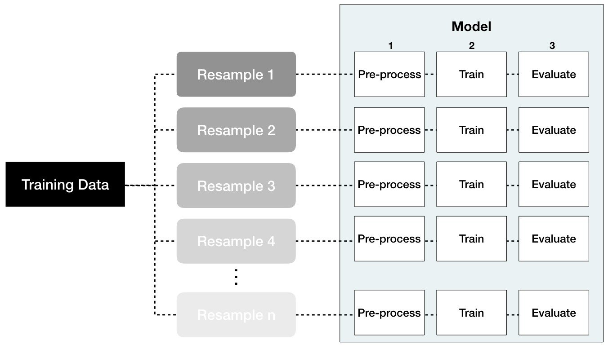

# Feature & Target Engineering {#engineering}

```{r 03-setup, include=FALSE}
knitr::opts_chunk$set(
  echo = TRUE,
  fig.align = "center",
  message = FALSE,
  warning = FALSE,
  collapse = TRUE,
  cache = TRUE    # turn on at the end
)

# FIXME: Why not just load the packages we need (e.g., purrr)?
# Answer: Becase I didn't know what I needed at the time
library(tidyverse)
# Set the graphical theme
theme_set(theme_light())

ames <- AmesHousing::make_ames()
```

Data pre-processing and engineering techniques generally refer to the addition, deletion, or transformation of data.  The time spent on identifying data engineering needs can be significant and requires you to spend substantial time understanding your data...or as Leo Breiman said "live with your data before you plunge into modeling" [@breiman2001statistical p. 201]. Although this book primarily focuses on applying machine learning algorithms, feature engineering can make or break an algorithm’s predictive ability and deserves your continued focus and education.

We will not cover all the potential ways of implementing feature engineering; however, we'll cover several fundamental pre-processing tasks that can potentially significantly improve modeling performance. Moreover, different models have different sensitivities to the type of target and feature values in the model and we will try to highlight some of these concerns. For more indepth coverage of feature engineering, please refer to @kuhn2019feature and @zheng2018feature.

## Prerequisites

This chapter leverages the following packages:

```{r 02-prereqs}
# Helper packages
library(dplyr)    # for data manipulation
library(ggplot2)  # for awesome graphics
library(visdat)   # for additional visualizations

# Feature engineering packages
library(caret)    # for various feature engineering tasks
library(recipes)  # for various feature engineering tasks
```

We'll also continue working with the `ames_train` data set created in Section \@ref(put-process-together):

```{r ames-train, echo=FALSE}
library(rsample)
# stratified sampling with the rsample package
set.seed(123)
split  <- initial_split(ames, prop = 0.7, strata = "Sale_Price")
ames_train  <- training(split)
ames_test   <- testing(split)
```

## Target engineering

Although not always a requirement, transforming the response variable can lead to predictive improvement, especially with parametric models (where require that certain assumptions about the model be met). For instance, ordinary linear regression models assume that the prediction errors (and hence the response) are normally distributed. This is usually fine, except when the prediction target has heavy tails (i.e., _outliers_) or is skewed in one direction or the other. In these cases, the normality assumption likely does not hold. For example, as we saw in the data splitting section (\@ref(splitting)), the response variable for the Ames housing data (`Sale_Price`) is right (or positively) skewed as illustrated in Figure \@ref(fig:distributions) (ranging from `r scales::dollar(min(ames$Sale_Price))` to `r scales::dollar(max(ames$Sale_Price))`). A simple linear model, say $\text{Sale\_Price}=\beta_{0} + \beta_{1} \text{Year\_Built} + \epsilon$, often assumes the error term $\epsilon$ (and hence `Sale_Price`) is normally distributed; fortunately, a simple log (or similar) transformation of the response can often help alleviate this concern as Figure \@ref(fig:skewed-residuals) illustrates.

```{r skewed-residuals, fig.width=6, fig.height=3, echo=FALSE, fig.cap="Transforming the response variable to minimize skewness can resolve concerns with non-normally distributed errors."}
models <- c("Non-log transformed model residuals", "Log transformed model residuals")

list(
  m1 = lm(Sale_Price ~ Year_Built, data = ames_train),
  m2 = lm(log(Sale_Price) ~ Year_Built, data = ames_train)
) %>%
  map2_dfr(models, ~ broom::augment(.x) %>% mutate(model = .y)) %>%
  ggplot(aes(.resid)) +
  geom_histogram(bins = 75) +
  facet_wrap(~ model, scales = "free_x") +
  ylab(NULL) +
  xlab("Residuals")
```

Furthermore, using a log (or other) transformation to minimize the response skewness can be used for shaping the business problem as well.  For example, in the House Prices: Advanced Regression Techniques Kaggle competition^[https://www.kaggle.com/c/house-prices-advanced-regression-techniques], which used the Ames housing data, the competition focused on using a log transformed Sale Price response  because "...taking logs means that errors in predicting expensive houses and cheap houses will affect the result equally." This would be an alternative to using the root mean squared logarithmic error (RMSLE) loss function as discussed in Section \@ref(model-eval).

There are two main approaches to help correct for postively skewed target variables:

__Option 1__: normalize with a log transformation\index{log transformation}. This will transform most right skewed distributions to be approximately normal. One way to do this is to simply log transform the training and test set in a manual, single step manner similar to:

```{r example-log, eval=FALSE}
transformed_response <- log(ames_train$Sale_Price)
```

However, we should think of the pre-processing as creating a blueprint to be re-applied strategically.  For this, you can use the __recipe__ package or something similar (e.g., `caret::preProcess()`). This will not return the actual log transformed values but, rather, a blueprint to be applied later.

```{r y_log}
# log transformation
ames_recipe <- recipe(Sale_Price ~ ., data = ames_train) %>%
  step_log(all_outcomes())

ames_recipe
```

If your reponse has negative values or zeros then a log transformation will produce `NaN`s and `-Inf`s, respectively (you cannot take the logarithm of a negative number).  If the nonpositive response values values are small (say between -0.99 and 0) then you can apply a small offset such as in `log1p()` which adds 1 to the value prior to applying a log transformation (you can do the same within `step_log()` by using the `offset` argument). If your data consists of values $\le -1$, use the Yeo-Johnson transformation mentioned next.

```{r neg_log, error=TRUE}
log(-0.5)
log1p(-0.5)
```

__Option 2__: use a _Box Cox transformation_\index{Box Cox transformation}. A Box Cox transformation is more flexible than (but also includes as a special case) the log transformation and will find an appropriate transformation from a family of power transforms that will transform the variable as close as possible to a normal distribution [@box1964analysis; @carroll1981prediction]. At the core of the Box Cox transformation is an exponent, lambda ($\lambda$), which varies from -5 to 5. All values of $\lambda$ are considered and the optimal value for the given data is estimated from the training data; The "optimal value" is the one which results in the best transofrmation to an approximate normal distribution. The transformation of the response $Y$ has the form:

 \begin{equation} 
 y(\lambda) =
\begin{cases}
   \frac{Y^\lambda-1}{\lambda}, & \text{if}\ \lambda \neq 0 \\
   \log\left(Y\right), & \text{if}\ \lambda = 0.
\end{cases}
\end{equation}

```{block, type = "warning"}
Be sure to compute the `lambda` on the training set and apply that same `lambda` to both the training and test set to minimize _data leakage_. The __recipes__ package automates this process for you.

If your response has negative values, the Yeo-Johnson transformation is very similar to the Box-Cox but does not require the input variables to be strictly positive. To apply, use `step_YeoJohnson()`. 
```

```{r y_boxcox, echo=FALSE}
# Box Cox transformation
ames_recipe <- recipe(Sale_Price ~ ., data = ames_train) %>%
  step_BoxCox(all_outcomes())
```

Figure \@ref(fig:distribution-comparison) illustrates that the log transformation and Box Cox transformation both do about equally well in transforming `Sale_Price` to look more normally distributed.

```{r distribution-comparison, echo=FALSE, message=FALSE, warning=FALSE, fig.cap="Response variable transformations.", fig.height=3, fig.width=9}
# log transformation
train_log_y <- log(ames_train$Sale_Price)
test_log_y  <- log(ames_train$Sale_Price)

# Box Cox transformation
lambda  <- forecast::BoxCox.lambda(ames_train$Sale_Price)
train_bc_y <- forecast::BoxCox(ames_train$Sale_Price, lambda)
test_bc_y  <- forecast::BoxCox(ames_test$Sale_Price, lambda)

# plot differences
data.frame(
  Normal = ames_train$Sale_Price,
  Log_Transform = train_log_y,
  BoxCox_Transform = train_bc_y
) %>%
  gather(Transform, Value) %>%
  mutate(Transform = factor(Transform, levels = c("Normal", "Log_Transform", "BoxCox_Transform"))) %>% 
  ggplot(aes(Value, fill = Transform)) +
  geom_histogram(show.legend = FALSE, bins = 40) +
  facet_wrap(~ Transform, scales = "free_x")
```

Note that when you model with a transformed response variable, your predictions will also be on the transformed scale.  You will likely want to re-transform your predicted values back to their normal scale so that decision-makers can more easily interpret the results.  This is illustrated in the following code chunk:

```{r inverse_bc}
# log transform a value
y <- log(10)

# re-transforming the log-transformed value
exp(y)

# Box Cox transform a value
y <- forecast::BoxCox(10, lambda)

# Inverse Box Cox function
inv_box_cox <- function(x, lambda) {
  # for Box-Cox, lambda = 0 is equivalent to log transform
  if (lambda == 0) exp(x) else (lambda*x + 1)^(1/lambda) 
}

# re-transforming the Box Cox-transformed value
inv_box_cox(y, lambda)
```

## Dealing with missingness

Data quality is an important issue for any project involving analyzing data. Data quality issues deserve an entire book in their own right, and a good reference is the The Quartz guide to bad data.^[https://github.com/Quartz/bad-data-guide] One of the most common data quality concerns you will run into is missing values.

Data can be missing for many different reasons; however, these reasons are usually lumped into two categories: _informative missingess_\index{informative missingess} [@apm] and _missingness at random_\index{missingness at random} [@little2014statistical]. Informative missinginess implies a structural cause for the missing value that can provide insight in its own right; whether this be definciencies in how the data was collected or abnormalities in the oberservational environment.  Missingness at random implies that missing values occur independent of the data collection process^[@little2014statistical discuss two different kinds of missingness at random; however, we combine them for simplicity as their nuanced differences are distinguished between the two in practice.]. 

The category that drives missing values will determine how you handle them.  For example, we may give values that are driven by informative missingness their own category (e.g., `"None"`) as their unique value may affect predictive performance.  Whereas values that are missing at random may deserve deletion^[If your data set is large, deleting missing observations that have missing values at random rarely impacts predictive performance. However, as your data sets get smaller, preserving observations is critical and alternative solutions should be explored.] or imputation. 

Furthermore, different machine learning models handle missingness differently.  Most algorithms cannot handle missingness (e.g., generalized linear models and their cousins, neural networks, and support vector machines) and, therefore, require them to be dealt with before hand.  A few models (mainly tree-based), have built-in procedures to deal with missing values.  However, since the modeling process involves comparing and contrasting multiple models to identify the optimal one, you will want to handle missing values prior to applying any models so that your algorithms are based on the same data quality assumptions.


### Visualizing missing values

It is important to understand the distribution of missing values (i.e., `NA`) in any data set. So far, we have been using a pre-processed version of the Ames housing data set (via the `AmesHousing::make_ames()` function). However, if we use the raw Ames housing data (via `AmesHousing::ames_raw`), there are actually `r scales::comma(sum(is.na(AmesHousing::ames_raw)))` missing values---there is at least one missing values in each row of the original data! 

```{r ames-raw-missing}
sum(is.na(AmesHousing::ames_raw))
```

It is important to understand the distribution of missing values in a data set in order to determine the best approach for pre-processing. Heat maps are an efficient way to visualize the distribution of missing values for small- to medium-sized data sets. The code `is.na(<data-frame-name>)` will return a matrix of the same dimension as the given data frame, but each cell will contain either `TRUE` (if the corresponding value is missing) or `FALSE` (if the corresponding value is not missing). To construct such a plot, we can use R's built-in `heatmap()` or `image()` functions, or __ggplot2__'s `geom_raster()` function, among others; Figure \@ref(fig:heat-map-missingness) illustrates `geom_raster()`. This allows us to easily see where the majority of missing values occur (i.e., in the variables `Alley`, `Fireplace Qual`, `Pool QC`, `Fence`, and `Misc Feature`). Due to their high frequency of missingness, these variables would likely need to be removed prior to statiscial analysis, or imputed. We can also spot obvious patterns of missingness. For example, missing values appear to occur within the same observations across all garage variables. 

```{r heat-map-missingness, fig.width=8, fig.height=5, out.width="100%", fig.cap = "Heat map of missing values in the raw Ames housing data."}
AmesHousing::ames_raw %>%
  is.na() %>%
  reshape2::melt() %>%
  ggplot(aes(Var2, Var1, fill=value)) + 
    geom_raster() + 
    coord_flip() +
    scale_y_continuous(NULL, expand = c(0, 0)) +
    scale_fill_grey(name = "", labels = c("Present", "Missing")) +
    xlab("Observation") +
    theme(axis.text.y  = element_text(size = 4))
```

Digging a little deeper into these variables, we might notice that `Garage_Cars` and `Garage_Area` contain the value `0` whenever the other `Garage_xx` variables have missing values (i.e. a value of `NA`). This might be because they did not have a way to identify houses with no garages when the data were originally collected, and therefore, all houses with no garage were identified by including nothing. Since this missingness is informative, it would be appropriate to impute `NA` with a new category level (e.g., `"None"`) for these garage variables. Circumstances like this tend to only become apparent upon careful descriptive and visual examination of the data!

```{r missingness-garages}
AmesHousing::ames_raw %>% 
  filter(is.na(`Garage Type`)) %>% 
  select(`Garage Type`, `Garage Cars`, `Garage Area`)
```

The `vis_miss()` function in R package `visdat` [@R-visdat] also allows for easy visualization of missing data patterns (with sorting and clustering options). We illustrate this functionality below using the raw Ames housing data (Figure \@ref(fig:missingness-visna)). The columns of the heat map represent the `r ncol(AmesHousing::ames_raw)` variables of the raw data and the rows represent the observations. Missing values (i.e., `NA`) are inidcated via a black cell. The variables and `NA` patterns have been clustered by rows (i.e., `cluster = TRUE`).

```{r missingness-visna, fig.height=7, fig.width=12, fig.cap="Visualizing missing patterns in the raw Ames housing data."}
vis_miss(AmesHousing::ames_raw, cluster = TRUE)
```

Data can be missing for different reasons. Perhaps the values were never recoded (or lost in translation), or it was recorded in error (a common feature of data enetered by hand). Regardless, it is important to identify and attempt to understand how missing values are distributed across a data set as it can provide insight into how to deal with these observations.

### Imputation {#impute}

_Imputation_\index{imputation} is the process of replacing a missing value with a substituted, "best guess" value. Imputation should be one of the first feature engineering steps yo take as it will effect any downstream pre-processing^[For example, standardizing numeric features will include the imputed numeric values in the calculation and one-hot encoding will include the imputated categorical value.]. 

#### Estimated statistic

An elementary approach to imputing missing values for a feature is to compute descriptive statistics such as the mean, median, or mode (for categorical) and use that value to replace `NA`s. Although computationally efficient, this approach does not consider any other attributes for a given observation when imputing (e.g., a female patient that is 63 inches tall may have her weight imputed as 175 lbs since that is the average weight across all observations which contains 65% males that average a height of 70 inches).  

An alternative is to try use grouped statistics to capture expected values for observations that fall into similar groups. However, this becomes infeasable for larger data sets.  Modeling imputation can automate this process for you and the two most common methods include K-nearest neighbor and tree-based imputation, which are discussed next.

However, it is important to remember that imputation should be performed __within the resampling process__ and as your data set gets larger, repeated model-based imputation can compound the computational demands.  Thus, you must weigh the pros and cons of the two approaches. The following would build onto our `ames_recipe` and impute all missing values for the `Gr_Liv_Area` variable with the median value:

```{r mean-impute}
ames_recipe %>%
  step_medianimpute(Gr_Liv_Area)
```

```{block, type = "tip"}
Use `step_modeimpute()` to impute categorical features with the most common value.
```

#### _K_-nearest neighbor

_K_-nearest neighbor (KNN) imputes values by identifying observations with missing values, then identifying other observations that are most similar based on the other available features, and using the values from these nearest neighbor observations to impute missing values.

We discuss KNN for predictive modeling in Chapter \@ref(knn); the imputation application works in a similar manner.  In KNN imputation, the missing value for a given observation is treated as the targeted response and is predicted based on the average (for quantitative values) or the mode (for qualitative values) of the _k_ nearest neighbors.

As discussed in Chapter \@ref(knn), if all features are quantitative then standard Euclidean distance is commonly used as the distance metric to identify the _k_ neighbors and when there is a mixture of quantitative and qualitative features then Gower's distance [@gower1971general] can be used. KNN imputation is best used on small to moderate sized data sets as it becomes computationally burdomesome with larger data sets [@kuhn2019feature].

```{block, type = "note"}
As we saw in Section 2.7, _k_ is a tunable hyperparameter. Suggested values for imputation are 5--10 [@kuhn2019feature]. By default, `step_knnimpute()` will use 5 but can be adjusted with the `neighbors` argument.
```

```{r knn-impute}
ames_recipe %>%
  step_knnimpute(all_predictors(), neighbors = 6)
```


#### Tree-based

As previously discussed, several implementations of decision trees (Chapter \@ref(DT)) and their derivatives can be constructed in the presence of missing values. Thus, they provide a good alternative for imputation. As discussed in Chapters \@ref(DT)-\@ref(random-forest), single trees have high variance but aggregating across many trees creates a robust, low variance predictor. Random forest imputation procedures have been studied [@shah2014comparison; @stekhoven2015missforest]; however, they require significant computational demands in a resampling environment [@kuhn2019feature]. Bagged trees (Chapter \@ref(bagging)) offer a compromise between predictive accuracy and computational burden.

Similar to KNN imputation, observations with missing values are identified and the feature containing the missing value is treated as the target and predicted using bagged decision trees.

```{r bagging-impute}
ames_recipe %>%
  step_bagimpute(all_predictors())
```

Figure \@ref(fig:imputation-examples) illustrates the differences between mean, KNN, and tree-based imputation on the raw Ames housing data. It is apparent how descriptive statistic methods (e.g., using the mean and median) are inferior to the KNN and tree-based imputation methods.

```{r imputation-examples, echo=FALSE, fig.cap="Comparison of three different imputation methods. The red points represent actual values which were removed and made missing and the blue points represent the imputed values. Estimated statistic imputation methods (i.e. mean, median) merely predict the same value for each observation and can reduce the signal between a feature and the response; whereas KNN and tree-based procedures tend to maintain the feature distribution and relationship."}
library(recipes)
impute_ames <- ames_train

set.seed(123)
index <- sample(seq_along(impute_ames$Gr_Liv_Area), 50)
actuals <- ames_train[index, ]
impute_ames$Gr_Liv_Area[index] <- NA

p1 <- ggplot() +
  geom_point(data = impute_ames, aes(Gr_Liv_Area, Sale_Price), alpha = .2) +
  geom_point(data = actuals, aes(Gr_Liv_Area, Sale_Price), color = "red") +
  scale_x_log10(limits = c(300, 5000)) +
  scale_y_log10(limits = c(10000, 500000)) +
  ggtitle("Actual values")

# Mean imputation
mean_juiced <- recipe(Sale_Price ~ ., data = impute_ames) %>%
  step_meanimpute(Gr_Liv_Area) %>%
  prep(training = impute_ames, retain = TRUE) %>%
  juice()

mean_impute <- mean_juiced[index, ]
  
p2 <- ggplot() +
  geom_point(data = actuals, aes(Gr_Liv_Area, Sale_Price), color = "red") +
  geom_point(data = mean_impute, aes(Gr_Liv_Area, Sale_Price), color = "blue") +
  scale_x_log10(limits = c(300, 5000)) +
  scale_y_log10(limits = c(10000, 500000)) +
  ggtitle("Mean Imputation")

# KNN imputation
knn_juiced <- recipe(Sale_Price ~ ., data = impute_ames) %>%
  step_knnimpute(Gr_Liv_Area) %>%
  prep(training = impute_ames, retain = TRUE) %>%
  juice()

knn_impute <- knn_juiced[index, ]
  
p3 <- ggplot() +
  geom_point(data = actuals, aes(Gr_Liv_Area, Sale_Price), color = "red") +
  geom_point(data = knn_impute, aes(Gr_Liv_Area, Sale_Price), color = "blue") +
  scale_x_log10(limits = c(300, 5000)) +
  scale_y_log10(limits = c(10000, 500000)) +
  ggtitle("KNN Imputation")

# Bagged imputation
bagged_juiced <- recipe(Sale_Price ~ ., data = impute_ames) %>%
  step_bagimpute(Gr_Liv_Area) %>%
  prep(training = impute_ames, retain = TRUE) %>%
  juice()

bagged_impute <- bagged_juiced[index, ]
  
p4 <- ggplot() +
  geom_point(data = actuals, aes(Gr_Liv_Area, Sale_Price), color = "red") +
  geom_point(data = bagged_impute, aes(Gr_Liv_Area, Sale_Price), color = "blue") +
  scale_x_log10(limits = c(300, 5000)) +
  scale_y_log10(limits = c(10000, 500000)) +
  ggtitle("Bagged Trees Imputation")

gridExtra::grid.arrange(p1, p2, p3, p4, nrow = 2)
```

## Feature filtering 

In many data analyses and modeling projects we end up with hundreds or even thousands of collected features. From a practical perspective, a model with more features often becomes harder to interpret and is costly to compute.  Some models are more resistant to non-informative predictors (e.g., the Lasso and tree-based methods) than others as illustrated in Figure \@ref(fig:accuracy-comparison).^[See @apm section 19.1 for data set generation.] 

```{r accuracy-comparison, echo=FALSE, fig.width=10, fig.height=3.5, fig.cap="Test set RMSE profiles when non-informative predictors are added."}
library(tidyverse)

model_results <- read_csv("data/feature-selection-impacts-results.csv") %>%
  mutate(type = case_when(
    model %in% c("lm", "pcr", "pls", "glmnet", "lasso") ~ "Linear models",
    model %in% c("earth", "svmLinear", "nn") ~ "Non-linear Models",
    TRUE ~ "Tree-based Models"
  )) %>%
  mutate(model = case_when(
    model == "lm" ~ "Linear regression",
    model == "earth" ~ "Multivariate adaptive regression splines",
    model == "gbm" ~ "Gradient boosting machines",
    model == "glmnet" ~ "Elastic net",
    model == "lasso" ~ "Lasso",
    model == "nn" ~ "Neural net",
    model == "pcr" ~ "Principal component regression",
    model == "pls" ~ "Partial least squares",
    model == "ranger" ~ "Random forest",
    TRUE ~ "Support vector machine"
  ))

ggplot(model_results, aes(NIP, RMSE, color = model, lty = model)) +
  geom_line() +
  geom_point() +
  facet_wrap(~ type, nrow = 1) +
  xlab("Number of additional non-informative predictors")
```

Although the performance of some of our models are not significantly affected by non-informative predictors, the time to train these models can be negatively impacted as more features are added. Figure \@ref(fig:impact-on-time) shows the increase in time to perform 10-fold CV on the exemplar data, which consists of 10,000 observations.  We see that many algorithms (e.g., elastic nets, random forests, and gradient boosting machines) become extremely time intensive the more predictors we add.  Consequently, filtering or reducing features prior to modeling may significantly speed up training time. 

```{r impact-on-time, echo=FALSE, fig.width=10, fig.height=3.5, fig.cap="Impact in model training time as non-informative predictors are added."}
model_results %>%
  group_by(model) %>%
  mutate(
    time_impact = time / first(time),
    time_impact = time_impact - 1
    ) %>%
  ggplot(aes(NIP, time_impact, color = model, lty = model)) +
  geom_line() +
  geom_point() +
  facet_wrap(~ type, nrow = 1) +
  scale_y_continuous("Percent increase in training time", labels = scales::percent) +
  xlab("Number of additional non-informative predictors")
```

Zero and near-zero variance variables are low-hanging fruit to eliminate. Zero variance variables\index{zero variance}, meaning the feature only contains a single uniquen value, provides no useful information to a model.  Some algorithms are unaffected by zero variance features.  However, features that have near-zero variance\index{near-zero variance} also offer very little, if any, information to a model. Furthermore, they can cause problems during resampling as there is a high probability that a given sample will only contain a single unique value (the dominant value) for that feature. A rule of thumb for detecting near-zero variance features is:

- The fraction of unique values over the sample size is low (say $ \leq 10$%).
- The ratio of the frequency of the most prevalent value to the frequency of the second most prevalent value is large (say $ \geq 20$%).

If both of these criteria are true then it is often adventageous to remove the variable from the model. For the Ames data, we do not have any zero variance predictors but there are 20 features that meet the near-zero threshold.

```{r nzv}
caret::nearZeroVar(ames_train, saveMetrics= TRUE) %>% 
  rownames_to_column() %>% 
  filter(nzv)
```

```{block, type = "note"}
We can add `step_zv()` and `step_nzv()` to our `ames_recipe` to remove zero or near-zero variance features.
```

Other feature filtering methods exist; see @saeys2007review for a thorough review. Furthermore, several wrapper methods exist that evaluate multiple models using procedures that add or remove predictors to find the optimal combination of features that maximizes model performance (see, for example, @kursa2010feature, @granitto2006recursive, @maldonado2009wrapper). However, this topic is beyond the scope of this book.

## Numeric feature engineering

Numeric features can create a host of problems for certain models when their distributions are skewed, contain outliers, or have a wide range in magnitudes. Tree-based models are quite immune to these types of problems in the feature space, but many other models (e.g., GLMs, regularized regression, KNN, support vector machines, neural networks) can be greatly hampered by these issues. Normalizing and standardizing heavily skewed features can help minimize these concerns.

### Skewness

Similar to the process discussed to normalize target variables, parametric models that have distributional assumptions (e.g., GLMs, and regularized models) can benefit from minimizing the skewness of numeric features.  When normalizing many variables, its best to use the Box-Cox (when feature values are strictly positive) or Yeo-Johnson (when feature values are not strictly positive) procedures as these methods will identify if a transformation is required and what the optimal transformation will be.

```{block, type = "note"}
Non-parametric models are rarely affected by skewed features; however, normalizing features will not have a negative affect on these models' performance.  For example, normalizing features will only shift the optimal split points in tree-based algorithms.  Consequently, when in doubt, normalize.
```

```{r normalizing}
# we can normalize all numeric features, including the response 
# at the same time
recipe(Sale_Price ~ ., data = ames_train) %>%
  step_YeoJohnson(all_numeric())                 
```


### Standardization

We must also consider the scale on which the individual features are measured. What are the largest and smallest values across all features and do they span several orders of magnitude? Models that incorporate smooth functions of input features are sensitive to the scale of the inputs. For example, $5X+2$ is a simple linear function of the input _X_, and the scale of its output depends directly on the scale of the input. Many algorithms use linear functions within their algorithms, some more obvious (e.g., GLMs and regularized regression) than others (e.g., neural networks, support vector machines, and principal components analysis). Other examples include algorithms that use distance measures such as the Euclidean distance (e.g., _k_ nearest neighbor, _k_-means clustering, and hierarchical clustering). 

For these models and modeling components, it is often a good idea to _standardize_\index{standardize} the features. Standardizing features includes _centering_ and _scaling_ so that numeric variables have zero mean and unit variance, which provides a common comparable unit of measure across all the variables.

```{r standardizing, echo=FALSE, fig.height=3, fig.cap="Standardizing features allows all features to be compared on a common value scale regardless of their real value differences."}
set.seed(123)
x1 <- data_frame(
  variable = "x1",
  `Real value` = runif(25, min = -30, max = 5),
  `Standardized value` = scale(`Real value`) %>% as.numeric()
)

set.seed(456)
x2 <- data_frame(
  variable = "x2",
  `Real value` = rlnorm(25, log(25)),
  `Standardized value` = scale(`Real value`) %>% as.numeric()
)

set.seed(789)
x3 <- data_frame(
  variable = "x3",
  `Real value` = rnorm(25, 150, 15),
  `Standardized value` = scale(`Real value`) %>% as.numeric()
)

x1 %>%
  bind_rows(x2) %>%
  bind_rows(x3) %>%
  gather(key, value, -variable) %>%
  mutate(variable = factor(variable, levels = c("x3", "x2", "x1"))) %>%
  ggplot(aes(value, variable)) +
  geom_point(alpha = .6) +
  facet_wrap(~ key, scales = "free_x") +
  ylab("Feature") +
  xlab("Value")

```

Some packages (e.g., __glmnet__, and __caret__) have built-in options to standardize and some do not (e.g., __keras__ for neural networks). However, you should standardize your variables within the recipe blueprint so that both training and test data standardization are based on the same mean and variance. This helps to minimize data leakage.

```{r standardizing-recipes}
ames_recipe %>%
  step_center(all_numeric(), -all_outcomes()) %>%
  step_scale(all_numeric(), -all_outcomes())
```

## Categorical feature engineering

Most models require that the predictors take numeric form.  There are exceptions, for example, tree-based models naturally handle numeric or categorical features.  However, even tree-based models can benefit from pre-processing categorical features.  The following sections will discuss a few of the more common approaches to engineer categorical features.

### Lumping

Sometimes features will contain levels that have very few observations.  For example, there are 28 unique neighborhoods represented in the Ames housing data but several of them only have a few observations.   

```{r overall-qual-levels}
count(ames_train, Neighborhood) %>% arrange(n)
```

Even numeric features can have similar distributions. For example, `Screen_Porch` has 92% values recorded as zero (zero square footage meaning no screen porch) and the remaining 8% have unique dispersed values. 

```{r screen-porch}
count(ames_train, Screen_Porch) %>% arrange(n)
```

Sometimes we can benefit from collapsing, or "lumping" these into a lesser number of categories.  In the above examples, we may want to collapse all levels that are observed in less than 10% of the training sample into an "other" category.  We can use `step_other()` to do so.  However, lumping should be used sparingly as there is often a loss in model performance [@apm].    

```{block, type = "tip"}
Tree-based models often perform exceptionally well with high cardinality features and are not as impacted by levels with small representation.
```

```{r}
# lump levels for two features
lumping <- recipe(Sale_Price ~ ., data = ames_train) %>%
  step_other(Neighborhood, threshold = .01, other = "other") %>%
   step_other(Screen_Porch, threshold = .1, other = ">0")

# apply this blue print --> you will learn about this at 
# the end of the chapter
apply_2_training <- prep(lumping, training = ames_train) %>%
  bake(ames_train)

# new distribution of Neighborhood
count(apply_2_training, Neighborhood) %>% arrange(n)

# new distribution of Screen_Porch
count(apply_2_training, Screen_Porch) %>% arrange(n)
```

### One-hot & dummy encoding

Many models require that all predictor variables be numeric.  Consequently, we need to intelligently transform any categorical variables into numeric representations so that these algorithms can compute.  Some packages automate this process (e.g., __h2o__ and __caret__) while others do not (e.g., __glmnet__ and __keras__). There are many ways to re, say,code categorical variables as numeric (e.g., one-hot, ordinal, binary, sum, and Helmert).

The most common is referred to as one-hot encoding, where we transpose our categorical variables so that each level of the feature is represented as a boolean value.  For example, one-hot encoding\index{one-hot encoding} `x` in the following

```{r one-hot, echo=FALSE, fig.cap='Eight observations containing a categorical feature x.'}
library(knitr)
library(kableExtra)

set.seed(1)
ex1 <- data.frame(id = 1:8, x = sample(letters[1:3], 8, replace = TRUE))
knitr::kable(ex1)
```

results in the following representation:

```{r one-hot2, echo=FALSE, fig.cap='Results of one-hot encoding categorical feature x.'}
one_hot <- dummyVars(' ~ .', ex1, fullRank = FALSE)
ex2 <- predict(one_hot, ex1)
knitr::kable(ex2)
```

This is called less than _full rank_ encoding where we retain all variables for each level of `x`.  However, this creates perfect collinearity which causes problems with some predictive modeling algorithms (e.g., ordinary linear regression and neural networks).  Alternatively, we can create a full-rank encoding by dropping one of the levels (level `a` has been dropped). This is referred to as _dummy_ encoding\index{dummy encoding}. 

```{r one-hot3, echo=FALSE, fig.cap='Results of dummy encoding categorical feature x.'}
dummy <- dummyVars( ~ ., ex1, fullRank = TRUE)
ex3 <- predict(dummy, ex1)
knitr::kable(ex3)
```

We can one-hot or dummy encode with the same function (`step_dummy()`). By default, `step_dummy()` will create a full rank encoding but you can change this by setting `one_hot = TRUE`.

```{r}
# lump levels for two features
recipe(Sale_Price ~ ., data = ames_train) %>%
  step_dummy(all_nominal(), one_hot = TRUE)
```


```{block, type="tip"}
Since one-hot encoding adds new features it can significantly increase the dimensionality of our data.  If you have a data set with many categorical variables and those categorical variables in turn have many unique levels, the number of features can explode.  In these cases you may want to explore label/ordinal encoding or some other alternative.
```

### Label encoding

_Label encoding_\index{label encoding} is a pure numeric conversion of the levels of a categorical variable. If a categorical variable is a factor and it has pre-specified levels then the numeric conversion will be in level order. If no levels are specified, the encoding will be based on alphabetical order. For example, the `MS_SubClass` variable has 16 levels, which we can recode numerically with `step_integer()`.

```{r label-encoding}
# original categories
count(ames_train, MS_SubClass)

# label encoded
recipe(Sale_Price ~ ., data = ames_train) %>%
  step_integer(MS_SubClass) %>%
  prep(ames_train) %>%
  bake(ames_train) %>%
  count(MS_SubClass)
```

We should be careful with label encoding unordered categorical features because most models will treat them as ordered numeric features. If a categorical feature is naturally ordered then label encoding is a natural choice (most commonly referred to as ordinal encoding).  For example, the various quality features in the Ames housing data are ordinal in nature (ranging from `Very_Poor` to `Very_Excellent`).

```{r qual-variables}
ames_train %>% select(contains("Qual"))
```

Ordinal encoding\index{ordinal encoding} these features provides a natural and intuitive interpretation and can logically be applied to all models.

```{block, type="tip"}
The various `xxx_Qual` features in the Ames housing are not ordered factors.  For ordered factors you could also use `step_ordinalscore()`.
```

```{r ordinal-encoding}
# original categories
count(ames_train, Overall_Qual)

# label encoded
recipe(Sale_Price ~ ., data = ames_train) %>%
  step_integer(Overall_Qual) %>%
  prep(ames_train) %>%
  bake(ames_train) %>%
  count(Overall_Qual)
```

### Alternatives

There are several alternative categorical encodings that are implemented in various R machine learning engines and are worth exploring.  For example, target encoding\index{target encoding} is the process of replacing a categorical value with the mean (regression) or proportion (classification) of the target variable.  For example, target encoding the `Neighborhood` feature would change `North_Ames` to 144617.

```{r target-encoding, echo=FALSE, fig.cap='Example of target encoding the Neighborhood feature of the Ames housing data set.'}
ames_train %>%
  group_by(Neighborhood) %>%
  summarize(`Avg Sale_Price` = mean(Sale_Price, na.rm = TRUE)) %>%
  head(10) %>%
  kable()
```

Target encoding runs the risk of _data leakage_ since you are using the reponse variable to encode a feature.  An alternative to this is to change the feature value to represent the proportion a particular level represents for a given feature.  In this case, `North_Ames` would be changed to 0.153.

```{block, type="note"}
In Chapter 9, we discuss how tree-based models use this approach to order categorical features when choosing a split point.
```

```{r proportion-encoding, echo=FALSE, fig.cap='Example of categorical proportion encoding the Neighborhood feature of the Ames housing data set.'}
ames_train %>%
  count(Neighborhood) %>%
  mutate(Proportion = n / sum(n)) %>%
  select(-n) %>%
  head(10) %>%
  kable()
```

Several alternative approaches include effect or likelihood encoding [@micci2001preprocessing; @zumel2016vtreat], empirical Bayes methods [@west2014linear], word and entity embeddings [@guo2016entity; @chollet2018deep], and more.  For more indepth coverage of categorical encodings we highly recommend @kuhn2019feature.

## Dimension reduction {#feature-reduction}

Dimension reduction is an alternative approach to filter out non-informative features without manually removing them. We discuss dimension reduction topics in depth later in the book (Chapters \@ref(pca)-\@ref(autoencoders)) so please refer to those chapters for details.

However, we wanted to highlight that it is very common to include these types of dimension reduction approaches during the feature engineering process.  For example, we may wish to reduce the dimension of our features with principal components analysis\index{principal components analysis} (Chapter \@ref(pca)) and retain the number of components required to explain, say, 95% of the variance and use these components as features in downstream modeling.

```{r pca}
recipe(Sale_Price ~ ., data = ames_train) %>%
  step_center(all_numeric()) %>%
  step_scale(all_numeric()) %>%
  step_pca(all_numeric(), threshold = .95)
```


## Proper implementation

We stated at the beginning of this chapter that we should think of feature engineering as creating a blueprint rather than manually performing each task individually.  This helps us in two ways: (1) thinking sequentially and (2) to apply appropriately within the resampling process.  

### Sequential steps 

Thinking of feature engineering as a blueprint forces us to think of the ordering of our pre-processing steps. Although each particular problem requires you to think of the effects of sequential pre-processing, there are some general suggestions that you should consider:

- If using a log or Box-Cox transformation, don’t center the data first or do any operations that might make the data non-positive. Alternatively, use the Yeo-Johnson transformation so you don’t have to worry about this.
- One-hot or dummy encoding typically results in sparse data which many algorithms can operate efficiently on. If you standardize sparse data you will create dense data and you loose the computational efficiency.  Consequently, its often preferred to standardize your numeric features and then one-hot/dummy encode.
- If you are lumping infrequently categories together, do so before one-hot/dummy encoding.
- Although you can perform dimension reduction procedures on categorical features, it is common to primarily do so on numeric features when doing so for feature engineering purposes.

While your project’s needs may vary, here is a suggested order of potential steps that should work for most problems:

1. Filter out zero or near-zero variance features.
2. Perform imputation if required.
3. Normalize to resolve numeric feature skewness.
4. Standardize (center and scale) numeric features.
5. Perform dimension reduction (e.g., PCA) on numeric features.
6. One-hot or dummy encode categorical features.

### Data leakage

_Data leakage_\index{data leakage} is when information from outside the training data set is used to create the model. Data leakage often occurs during the data preprocessing period. To minimize this, feature engineering should be done in isolation of each resampling iteration. Recall that resampling allows us to estimate the generalizable prediction error.  Therefore, we should apply our feature engineering blueprint to each resample independently as illustrated in Figure \@ref(fig:minimize-leakage).  That way we are not leaking information from one data set to another (each resample is designed to act as isolated training and test data).  

```{r minimize-leakage, echo=FALSE, fig.cap="Performing feature engineering pre-processing within each resample helps to minimize data leakage.", out.width='90%'}

```

For example, when standardizing numeric features, each resampled training data should use its own mean and variance estimates and these specific values should be applied to the same resampled test set.  This imitates how real-life prediction occurs where we only know our current data's mean and variance estimates; therefore, on new data that comes in where we need to predict we assume the feature values follow the same distribution of what we've seen in the past.

### Putting the process together {#engineering-process-example}

To illustrate how this process works together via R code, let's do a simple re-assessment on the `ames` data set that we did at the end of the last chapter (section \@ref(put-process-together)) and see if some simple feature engineering improves our prediction error.  But first, we'll formally introduce the __recipes__ package, which we've been implicitly illustrating throughout.

The __recipes__ package allows us to develop our feature engineering blueprint in a sequential nature.  The idea behind __recipes__ is similar to `caret::preProcess()` where we want to create the pre-processing blueprint but apply it later and within each resample.^[In fact, most of the feature engineering capabilities found in __resample__ can also be found in `caret::preProcess()`.]

There are three main steps in creating and applying feature engineering with __recipes__:

1. `recipe`: where you define your feature engineering steps to create your blueprint.
2. `prep`are: estimate feature engineering parameters based on training data.
3. `bake`: apply the blueprint to new data.

The first step is where you define your blueprint (aka recipe).  With this process, you supply the formula of interest (the target variable, features, and the data these are based on) with `recipe()` and then you sequentially add feature engineering steps with `step_xxx()`. For example, the following defines `Sale_Price` as the target variable and then uses all the remaining columns as features based on `ames_train`. We then:

1. Remove near-zero variance features that are categorical (aka nominal).
2. Ordinally encode our quality-based features (which are inherently ordinal).
3. Center and scale (i.e., standardize) all numeric fetures.
4. Perform dimension reduction by applying PCA to all numeric features.

```{r step1-recipe}
blueprint <- recipe(Sale_Price ~ ., data = ames_train) %>%
  step_nzv(all_nominal())  %>%
  step_integer(matches("Qual|Cond|QC|Qu")) %>%
  step_center(all_numeric(), -all_outcomes()) %>%
  step_scale(all_numeric(), -all_outcomes()) %>%
  step_pca(all_numeric(), -all_outcomes())
  
blueprint
```

Next, we need to train this blueprint on some training data. Remember, there are many feature engineering steps that we do not want to train on the test data (e.g., standardize and PCA) as this would create data leakage.  So in this step we estimate these parameters based on the training data of interest.

```{r step2-prepare}
prepare <- prep(blueprint, training = ames_train)
prepare
```

Lastly, we can apply our blueprint to new data (e.g., the training data or future test data) with `bake()`.

```{r step3-bake}
baked_train <- bake(prepare, new_data = ames_train)
baked_test <- bake(prepare, new_data = ames_test)
baked_train
```

Consequently, the goal is to develop our blueprint, then within each resample iteration we want to apply `prep()` and `bake()` to our resample training and validation data.  Luckily, the __caret__ package simplifies this process.  We only need to specify the blueprint and __caret__ will automatically prepare and bake within each resample. We illustrate with the `ames` housing example.

First, we create our feature engineering blueprint to perform the following tasks:

1. Filter out near-zero variance features for categorical features.
2. Ordinally encode all quality features, which are on a 1--10 likert scale.
3. Standardize (center and scale) all numeric features.
4. One-hot encode our remaining categorical features.

```{r knn-blueprint}
blueprint <- recipe(Sale_Price ~ ., data = ames_train) %>%
  step_nzv(all_nominal()) %>%
  step_integer(matches("Qual|Cond|QC|Qu")) %>%
  step_center(all_numeric(), -all_outcomes()) %>%
  step_scale(all_numeric(), -all_outcomes()) %>%
  step_dummy(all_nominal(), -all_outcomes(), one_hot = TRUE)
```

Next, we apply the same resampling method and hyperparameter search grid as we did in Section \@ref(put-process-together). The only difference is when we train our resample models with `train()`, we supply our blueprint as the first argument and then __caret__ takes care of the rest.

```{r knn-with-blueprint}
# create a resampling method
cv <- trainControl(
  method = "repeatedcv", 
  number = 10, 
  repeats = 5
  )

# create a hyperparameter grid search
hyper_grid <- expand.grid(k = seq(2, 25, by = 1))

# fit knn model and perform grid search
knn_fit2 <- train(
  blueprint, 
  data = ames_train, 
  method = "knn", 
  trControl = cv, 
  tuneGrid = hyper_grid,
  metric = "RMSE"
  )
```

Looking at our results we see that the best model was associated with $k=$ `r knn_fit2$bestTune$k`, which resulted in a cross-validated RMSE of `r knn_fit2$results %>% filter(k == knn_fit2$bestTune$k) %>% pull(RMSE) %>% scales::comma()`.  Figure \@ref(fig:knn-with-blueprint-assess) illustrates the cross-validated error rate across the spectrum of hyperparameter values that we specified.

```{r knn-with-blueprint-assess, fig.height=3, fig.cap="Results from the same grid search performed in Section 2.7 but with feature engineering performed within each resample."}
# print model results
knn_fit2

# plot cross validation results
ggplot(knn_fit2)
```

By applying a handful of the preprocessing techniques discussed throughout this chapter, we were able to reduce our prediction error by over \$10,000.  The chapters that follow will look to see if we can continue reducing our error by applying different algorithms and feature engineering blueprints.
