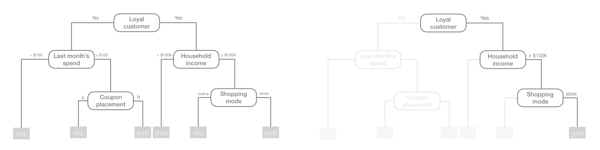

# Decision Trees {#DT}

```{r ch7-setup, include=FALSE}
# Set global R options
options(scipen = 999)

# Set the graphical theme
ggplot2::theme_set(ggplot2::theme_light())

# Set global knitr chunk options
knitr::opts_chunk$set(
  cache = TRUE,
  warning = FALSE, 
  message = FALSE, 
  collapse = TRUE, 
  fig.align = "center",
  fig.height = 3.5
)

library(tidyverse)
ames <- AmesHousing::make_ames()

# __FIXME:__ I have general code to draw decision boundaries for any classifier 
# in the SVM chapter; let's use that so you don't have to manually plot them 
# with different geoms.
```

_Tree-based models_\index{tree-based models} are a class of nonparametric algorithms that work by partitioning the feature space into a number of smaller (non-overlapping) regions with similar response values using a set of _splitting rules_\index{splitting rules}. Predictions are obtained by fitting a simpler model (e.g., a constant like the average response value) in each region. Such _divide-and-conquor_ methods can produce simple rules that are easy to interpret and visualize with _tree diagrams_\index{tree diagrams}. As we'll see, decision trees offer many benefits; however, they typically lack in predictive performance compared to more complex algorithms like neural networks and MARS. However, future chapters will discuss powerful ensemble algorithms---like random forests and gradient boosting machines---which are constructed by combining togther many decision trees in a clever way.  This chapter will provide you with a strong foundation in decision trees. 

## Prerequisites

In this chapter we'll use the following packages:

```{r dt-pkgs, message=FALSE}
# Helper packages
library(dplyr)       # for data wrangling
library(ggplot2)     # for awesome plotting

# Modeling packages
library(rpart)       # direct engine for decision tree application
library(caret)       # meta engine for decision tree application

# Model interpretability packages
library(rpart.plot)  # for plotting decision trees
library(vip)         # for feature importance
library(pdp)         # for feature effects
```

We'll continue to illustrate the main concepts using the Ames housing example from Section \@ref(put-process-together).

```{r dt-data-prereq, echo=FALSE}
# Create training (70%) set for the Ames housing data.
set.seed(123)
split  <- rsample::initial_split(ames, prop = 0.7, strata = "Sale_Price")
ames_train  <- rsample::training(split)
```


## Structure

There are many methodologies for constructing decision trees but the most well-known is the **c**lassification **a**nd **r**egression **t**ree\index{classification and regression tree} (CART) algorithm proposed in @breiman2017classification.^[Other decision tree algorithms include the Iterative Dichotomiser 3 [@quinlan1986induction], C4.5 [@quinlan1996bagging], Chi-square automatic interaction detection [@kass1980exploratory], Conditional inference trees [@hothorn2006unbiased], and more.] A basic decision tree partitions the training data into homogeneous subgroups (i.e., groups with similar response values) and then fits a simple _constant_ in each subgroup (e.g., the mean of the within group response values for regression). The subgroups (also called nodes) are formed recursively using binary partitions formed by asking simple yes-or-no questions about each feature (e.g., is `age < 18`?). This is done a number of times until a suitable stopping critera is satisfied (e.g., a maximum depth of the tree is reached). After all the partitioning has been done, the model predicts the output based on (1) the average response values for all observations that fall in that subgroup (regression problem), or (2) the class that has majority representation (classification problem). For classification, predicted probabilites can be obtained using the proportion of each class within the subgroup.

What results is an inverted tree-like structure such as that in Figure \@ref(fig:exemplar-decision-tree).  In essence, our tree is a set of rules that allows us to make predictions by asking simple yes-or-no questions about each feature.  For example, if the customer is loyal, has household income greater than \$150,000, and is shopping in a store, the examplar tree diagram in Figure \@ref(fig:exemplar-decision-tree) would predict that the customer will redeem a coupon. 

```{r exemplar-decision-tree, echo=FALSE, fig.cap="Exemplar decision tree predicting if a customer will redeem a coupon (yes or no) based on the customer's loyalty, household income, last month's spend, coupon placement, and shopping mode.", out.height="100%", out.width="100%"}

```

We refer to the first subgroup at the top of the tree as the _root node_\index{root node} (this node contains all of the training data). The final subgroups at the bottom of the tree are called the _terminal nodes_\index{terminal nodes} or _leaves_\index{leaves}. Every subgroup inbetween is refrred to as an internal node. The connection between nodes are called _branches_\index{branches}. 

```{r decision-tree-terminology, echo=FALSE, fig.cap="Terminology of a decision tree.", out.height="80%", out.width="80%"}
knitr::include_graphics("images/decision-tree-terminology.png")
```


## Partitioning

As illustrated above, CART uses _binary recursive partitioning_\index{binary recursive partitioning} (it's recursive because each split or rule depends on the the splits above it). The objective at each node is to find the "best" feature ($x_i$) to partition the remaing data into one of two regions ($R_1$ and $R_2$) such that the overall error between the actual response ($y_i$) and the predicted constant ($c_i$) is minimized.  For regression problems, the objective function seeks to minimize SSE as in \@ref(eq:partobjective). For classification problems, the partitioning is usually made to optimize cross-entropy or the Gini index (see Section \@ref(model-eval)).^[Gini index and cross-entropy are the two most commonly applied loss functions used for decision trees. Classification error is rarely used to determine partitions as they are less sensitive to poor performing splits [@esl].] 

```{block, type = "note"}
In both regression and classification trees, the objective of partitioning is to minimize dissimilarity in the terminal nodes. However, we suggest @therneau1997introduction for a more thorough discussion regarding binary recursive partitioning.
```

\begin{equation}
(\#eq:partobjective)
\texttt{minimize} \bigg\{ SSE = \sum_{i \in R_1}(y_i - c_1)^2 + \sum_{i \in R_2}(y_i - c_2)^2 \bigg\}
\end{equation}

Having found the best feature/split combination, the data are partitioned into two regions and the splitting process is repeated on each of the two regions (hence the name binary recursive partioning). This process is continued until a suitable stopping criterion is reached (e.g., a maximum depth is reached or the tree becomes "too complex").

It's important to note that a single feature can be used multiple times in a tree. For example, say we have data generated from a simple $\sin$ function with $Y_i \stackrel{iid}{\sim} \left(\sin\left(X_i\right), \sigma^2\right)$ errors (for $i = 1, 2, \dots, 500$). A regression tree built with a single root node (often referred to as a decision stump) leads to a split occurring at $x = 3.1$.

```{r decision-stump, echo=FALSE, fig.width=4, fig.height=3, fig.show='hold', fig.cap="Decision tree illustrating the single split on feature x (left). The resulting decision boundary illustrates the predicted value when x < 3.1 (0.64), and when x > 3.1 (-0.67) (right).", out.width="48%"}
# create data
set.seed(1112)  # for reproducibility
df <- tibble::tibble(
  x = seq(from = 0, to = 2 * pi, length = 500),
  y = sin(x) + rnorm(length(x), sd = 0.5),
  truth = sin(x)
)

# run decision stump model
library(rpart)
ctrl <- list(cp = 0, minbucket = 5, maxdepth = 1)
fit <- rpart(y ~ x, data = df, control = ctrl)

# plot tree 
library(rpart.plot)
par(mar = c(1, 1, 1, 1))
rpart.plot(fit)

# plot decision boundary
library(ggplot2)
library(dplyr)
df %>%
  mutate(pred = predict(fit, df)) %>%
  ggplot(aes(x, y)) +
  geom_point(alpha = .2, size = 1) +
  geom_line(aes(x, y = truth), color = "blue", size = .75) +
  geom_line(aes(y = pred), color = "red", size = .75) +
  geom_segment(x = 3.1, xend = 3.1, y = -Inf, yend = -.95,
               arrow = arrow(length = unit(0.25,"cm")), size = .25) +
  annotate("text", x = 3.1, y = -Inf, label = "split", hjust = 1.2, vjust = -1, size = 3) +
  geom_segment(x = 5.5, xend = 6, y = 2, yend = 2, size = .75, color = "blue") +
  geom_segment(x = 5.5, xend = 6, y = 1.7, yend = 1.7, size = .75, color = "red") +
  annotate("text", x = 5.3, y = 2, label = "truth", hjust = 1, size = 3, color = "blue") +
  annotate("text", x = 5.3, y = 1.7, label = "decision boundary", hjust = 1, size = 3, color = "red")
```

If we build a deeper tree, we'll continue to split on the same feature ($x$) as illustrated in Figure \@ref(fig:depth-3-decision-tree). This is because $x$ is the only feature available to split on so it will continue finding the optimal splits along this feature's values until a pre-determined stopping criteria is reached. 

```{r depth-3-decision-tree, echo=FALSE, fig.width=4, fig.height=3, fig.show='hold', fig.cap="Decision tree illustrating with depth = 3, resulting in 7 decision splits along values of feature x and 8 prediction regions (left). The resulting decision boundary (right).", out.width="48%"}
# fit depth 3 decision tree
ctrl <- list(cp = 0, minbucket = 5, maxdepth = 3)
fit <- rpart(y ~ x, data = df, control = ctrl)
rpart.plot(fit)

# plot decision boundary
df %>%
  mutate(pred = predict(fit, df)) %>%
  ggplot(aes(x, y)) +
  geom_point(alpha = .2, size = 1) +
  geom_line(aes(x, y = truth), color = "blue", size = .75) +
  geom_line(aes(y = pred), color = "red", size = .75)
```

However, even when many features are available, a single feature may still dominate if it continues to provide the best split after each successive partition.  For example, a decision tree applied to the iris data set [@fisher1936use] where the species of the flower (setosa, versicolor, and virginica) is predicted based on two features (sepal width and sepal length) results in an optimal decision tree with two splits on each feature.  Also, note how the decision boundary in a classification problem results in rectangular regions enclosing the observations. The predicted value is the response class with the greatest proportion within the enclosed region.

```{r iris-decision-tree, echo=FALSE, fig.width=4, fig.height=3, fig.show='hold', fig.cap="Decision tree for the iris classification problem (left). The decision boundary results in rectangular regions that enclose the observations.  The class with the highest proportion in each region is the predicted value (right).", out.width="48%"}
# decision tree
iris_fit <- rpart(Species ~ Sepal.Length + Sepal.Width, data = iris)
rpart.plot(iris_fit)

# decision boundary
ggplot(iris, aes(Sepal.Length, Sepal.Width, color = Species, shape = Species)) +
  geom_point(show.legend = FALSE) +
  annotate("rect", xmin = -Inf, xmax = 5.44, ymin = 2.8, ymax = Inf, alpha = .75, fill = "orange") +
  annotate("text", x = 4.0, y = 4.4, label = "setosa", hjust = 0, size = 3) +
  annotate("rect", xmin = -Inf, xmax = 5.44, ymin = 2.79, ymax = -Inf, alpha = .75, fill = "grey") +
  annotate("text", x = 4.0, y = 2, label = "versicolor", hjust = 0, size = 3) +
  annotate("rect", xmin = 5.45, xmax = 6.15, ymin = 3.1, ymax = Inf, alpha = .75, fill = "orange") +
  annotate("text", x = 6, y = 4.4, label = "setosa", hjust = 1, vjust = 0, size = 3) +
  annotate("rect", xmin = 5.45, xmax = 6.15, ymin = 3.09, ymax = -Inf, alpha = .75, fill = "grey") +
  annotate("text", x = 6.15, y = 2, label = "versicolor", hjust = 1, vjust = 0, fill = "grey", size = 3) +
  annotate("rect", xmin = 6.16, xmax = Inf, ymin = -Inf, ymax = Inf, alpha = .75, fill = "green") +
  annotate("text", x = 8, y = 2, label = "virginica", hjust = 1, vjust = 0, fill = "green", size = 3)

```


## How deep?

This leads to an important question, how deep (i.e., complex) should we make the tree?  If we grow an overly complex tree as in Figure \@ref(fig:deep-overfit-tree), we tend to overfit to our training data resulting in poor generalization performance.

```{r deep-overfit-tree, echo=FALSE, fig.width=4, fig.height=3, fig.show='hold', fig.cap="Overfit decision tree with 56 splits.", out.width="48%"}
ctrl <- list(cp = 0, minbucket = 1, maxdepth = 50)
fit <- rpart(y ~ x, data = df, control = ctrl)
rpart.plot(fit)

df %>%
  mutate(pred = predict(fit, df)) %>%
  ggplot(aes(x, y)) +
  geom_point(alpha = .2, size = 1) +
  geom_line(aes(x, y = truth), color = "blue", size = 0.75) +
  geom_line(aes(y = pred), color = "red", size = 0.75)
```

Consequently, there is a balance to be achieved in the depth and complexity of the tree to optimize predictive performance on future unseen data. To find this balance, we have two primary approaches - (1) early stopping and (2) pruning. 

### Early stopping

Early stopping\index{early stopping} explicitly restricts the growth of the tree.  There are several ways we can restrict tree growth but two of the most common approaches is to restrict the tree depth to a certain level or to restrict the minimum number of observations allowed in any terminal node. When limiting tree depth we stop splitting after a certain depth (e.g., only grow a tree that has a depth of 5 levels).  The shallower the tree the less variance we have in our predictions; however, at some point we can start to inject too much bias as shallow trees (e.g., stumps) are not able to capture interactions and complex patterns in our data. 

When restricting minimum terminal node size (e.g., leaf nodes must contain at least 10 observations for predictions) we are deciding to not split intermediate nodes which contains too few data points. At the far end of the spectrum, a terminal node's size of one allows for a single observation to be captured in the leaf node and used as a prediction (in this case, we're interpolating the training data).  This results in high variance and poor generalizability.  On the other hand, large values restrict further splits therefore reducing variance.  

These two approaches can be implemented independently of one another; however, they do have interaction effects as illustrated by Figure \@ref(fig:dt-early-stopping). 

```{r dt-early-stopping, fig.width=10, fig.height=8, fig.cap="Illustration of how early stopping affects the decision boundary of a regression decision tree. The columns illustrate how tree depth impacts the decision boundary and the rows illustrate how the minimun number of observations in the terminal node influences the decision boundary.", echo=FALSE}
hyper_grid <- expand.grid(
  maxdepth = c(1, 5, 15),
  minbucket = c(1, 5, 15)
)
results <- data.frame(NULL)

for(i in seq_len(nrow(hyper_grid))) {
 ctrl <- list(cp = 0, maxdepth = hyper_grid$maxdepth[i], minbucket = hyper_grid$minbucket[i])
 fit <- rpart(y ~ x, data = df, control = ctrl) 
 
 predictions <- mutate(
   df, 
   minbucket = factor(paste("Min node size =", hyper_grid$minbucket[i]), ordered = TRUE),
   maxdepth = factor(paste("Max tree depth =", hyper_grid$maxdepth[i]), ordered = TRUE)
   )
 predictions$pred <- predict(fit, df)
 results <- rbind(results, predictions)
   
}

ggplot(results, aes(x, y)) +
  geom_point(alpha = .2, size = 1) +
  geom_line(aes(x, y = truth), color = "blue", size = .75) +
  geom_line(aes(y = pred), color = "red", size = 1) +
  facet_grid(minbucket ~ maxdepth)
```

### Pruning

An alternative to explicitly specifying the depth of a decision tree is to grow a very large, complex tree and then _prune_\index{prune} it back to find an optimal subtree. We find the optimal subtree by using a _cost complexity parameter_\index{cost complexity parameter} ($\alpha$) that penalizes our objective function in \@ref(eq:partobjective) for the number of terminal nodes of the tree ($T$) as in \@ref(eq:prune).

\begin{equation}
(\#eq:prune)
 \texttt{minimize} \left\{ SSE + \alpha \vert T \vert \right\}
\end{equation}

For a given value of $\alpha$ we find the smallest pruned tree that has the lowest penalized error. You may recognize the close association to the lasso penalty discussed in Chapter \@ref(regularized-regression). As with the regularization methods, smaller penalties tend to produce more complex models, which results in larger trees. Whereas larger penalties results in much smaller trees. Consequently, as a tree grows larger, the reduction in the SSE must be greater than the cost complexity penalty. Typically, we evaluate multiple models across a spectrum of $\alpha$ and use CV to identify the optimal value and, therefore, the optimal subtree that generalizes best to unseen data.

```{r pruned-tree, fig.width=10, fig.height = 4, fig.cap="To prune a tree, we grow an overly complex tree (left) and then use a cost complexity parameter to identify the optimal subtree (right).", echo=FALSE}
ctrl <- list(cp = 0, minbucket = 1, maxdepth = 50)
fit <- rpart(y ~ x, data = df, control = ctrl)

p1 <- df %>%
  mutate(pred = predict(fit, df)) %>%
  ggplot(aes(x, y)) +
  geom_point(alpha = .3, size = 2) +
  geom_line(aes(x, y = truth), color = "blue", size = 1) +
  geom_line(aes(y = pred), color = "red", size = 1)

fit2 <- rpart(y ~ x, data = df)

p2 <- df %>%
  mutate(pred2 = predict(fit2, df)) %>%
  ggplot(aes(x, y)) +
  geom_point(alpha = .3, size = 2) +
  geom_line(aes(x, y = truth), color = "blue", size = 1) +
  geom_line(aes(y = pred2), color = "red", size = 1)

gridExtra::grid.arrange(p1, p2, nrow = 1)
```


## Ames housing example

We can fit a regression tree using `rpart` and then visualize it using `rpart.plot`. The fitting process and the visual output of regression trees and classification trees are very similar.  Both use the formula method for expressing the model (similar to `lm()`).  However, when fitting a regression tree, we need to set `method = "anova"`. By default, `rpart()` will make an intelligent guess as to what method to use based on the data type of your response column, but it's good practice to set this explicitly.

```{r basic-ames-tree}
ames_dt1 <- rpart(
  formula = Sale_Price ~ .,
  data    = ames_train,
  method  = "anova"
)
```

Once we've fit our model we can take a peak at the decision tree output. This prints various information about the different splits.  For example, we start with `2054` observations at the root node and the first variable we split on (i.e., the first variable gave the largest reduction in SSE) is `Overall_Qual`. We see that at the first node all observations with `Overall_Qual=Very_Poor,Poor,Fair,Below_Average,Average,Above_Average,Good` go to the 2nd (`2)`) branch.  The total number of observations that follow this branch (`1721`), their average sales price (`156200`) and SSE (`3.964e+12`) are listed.  If you look for the 3rd branch (`3)`) you will see that `333` observations with `Overall_Qual=Very_Good,Excellent,Very_Excellent` follow this branch and their average sales prices is `304600` and the SEE in this region is `2.917e+12`.  Basically, this is telling us that `Overall_Qual` is an important predictor os sales price with those homes on the upper end of the quality spectrum having almost double the average sales price.

```{r basic-ames-tree-results}
ames_dt1
```

We can visualize our tree model with `rpart.plot()`.  The `rpart.plot()` function has many plotting options, which we'll leave to the reader to explore.  However, in the default print it will show the percentage of data that fall in each node and the predicted outcome for that node. One thing you may notice is that this tree contains 10 internal nodes resulting in 11 terminal nodes.  In other words, this tree is partitioning on only 10 features even though there are 80 variables in the training data.  Why is that?

```{r basic-ames-tree-plot, fig.width=10, fig.height=6, fig.cap="Diagram displaying the pruned decision tree for the Ames Housing data."}
rpart.plot(ames_dt1)
```

Behind the scenes `rpart()` is automatically applying a range of cost complexity ($\alpha$ values to prune the tree).  To compare the error for each $\alpha$ value, `rpart()` performs a 10-fold CV (by default).  In this example we find diminishing returns after 1`2` terminal nodes as illustrated in Figure \@ref(fig:plot-cp) ($y$-axis is the CV error, lower $x$-axis is the cost complexity ($\alpha$) value, upper $x$-axis is the number of terminal nodes (i.e., tree size = $\vert T \vert$).  You may also notice the dashed line which goes through the point $\vert T \vert = 8$.  @breiman2017classification suggested that in actual practice, its common to instead use the smallest tree within 1 standard error (SE) of the minimum CV error (this is called the _1-SE rule_).  Thus, we could use a tree with 8 terminal nodes and reasonably expect to experience similar results within a small margin of error.

```{r plot-cp, fig.width = 5, fig.height=3.5, fig.cap="Pruning complexity parameter (cp) plot illustrating the relative cross validation error (y-axis) for various cp values (lower x-axis). Smaller cp values lead to larger trees (upper x-axis). Using the 1-SE rule, a tree size of 10-12 provides optimal cross validation results."}
plotcp(ames_dt1)
```

To illustrate the point of selecting a tree with 11 terminal nodes (or 8 if you go by the 1-SE rule), we can force `rpart()` to generate a full tree by setting `cp = 0` (no penalty results in a fully grown tree).  Figure \@ref(fig:no-cp-tree) shows that after 11 terminal nodes, we see diminishing returns in error reduction as the tree grows deeper.  Thus, we can signifcantly prune our tree and still achieve minimal expected error.

```{r no-cp-tree, fig.cap="Pruning complexity parameter plot for a fully grown tree. Significant reduction in the cross validation error is achieved with tree sizes 6-20 and then the cross validation error levels off with minimal or no additional improvements."}
ames_dt2 <- rpart(
    formula = Sale_Price ~ .,
    data    = ames_train,
    method  = "anova", 
    control = list(cp = 0, xval = 10)
)

plotcp(ames_dt2)
abline(v = 11, lty = "dashed")
```

So, by default, `rpart()` is performing some automated tuning, with an optimal subtree of 10 total splits, 11 terminal nodes, and a cross-validated SSE of 0.292. Although `rpart()` does not provide the RMSE or other metrics, you can use __caret__. In both cases, smaller penalties (deeper trees) are providing better CV results.

```{r cp-table, fig.cap="Cross-validated accuracy rate for the 20 different $\\alpha$ parameter values in our grid search. Lower $\\alpha$ values (deeper trees) help to minimize errors.", fig.height=3}
# rpart cross validation results
ames_dt1$cptable

# caret cross validation results
ames_dt3 <- train(
  Sale_Price ~ .,
  data = ames_train,
  method = "rpart",
  trControl = trainControl(method = "cv", number = 10),
  tuneLength = 20
)

ggplot(ames_dt3)
```

## Feature interpretation {#dt-vip}

To measure feature importance, the reduction in the loss function (e.g., SSE) attributed to each variable at each split is tabulated. In some instances, a single variable could be used multiple times in a tree; consequently, the total reduction in the loss function across all splits by a variable are summed up and used as the total feature importance.  When using __caret__, these values are standardized so that the most important feature has a value of 100 and the remaining features are scored based on their relative reduction in the loss function. Also, since there may be candidate variables that are important but are not used in a split, the top competing variables are also tabulated at each split.

Figure \@ref(fig:dt-vip) illustrates the top 40 features in the Ames housing decision tree. Similar to MARS (Chapter \@ref(mars)), decision trees perform automated feature selection where uninformative features are not used in the model. We can see this in Figure \@ref(fig:dt-vip) where the bottom four features in the plot have zero importance.

```{r dt-vip, fig.height=5.5, fig.cap="Variable importance based on the total reduction in MSE for the Ames Housing decision tree."}
vip(ames_dt3, num_features = 40, bar = FALSE)
```

If we look at the same partial dependence plots that we created for the MARS models (Section \@ref(mars-features)), we can see the similarity in how decision trees are modeling the relationship between the features and target.  In \@ref(fig:dt-pdp), we see that `Gr_Liv_Area` has a non-linear relationship such that it has increasingly stronger effects on the predicted sale price for `Gr_liv_Area` values between 1000--2500 but then has little, if any, influence when it exceeds 2500. However, the 3-D plot of the interaction effect between `Gr_Liv_Area` and `Year_Built` illustrates a key difference in how decision trees have rigid non-smooth prediction surfaces compared to MARS; in fact, MARS was developed as an imporvement to CART for regression problems.

```{r dt-pdp, fig.width=10, fig.height= 3.5, fig.cap="Partial dependence plots to understand the relationship between sale price and the living space, and year built features."}
# Construct partial dependence plots
p1 <- partial(ames_dt3, pred.var = "Gr_Liv_Area") %>% autoplot()
p2 <- partial(ames_dt3, pred.var = "Year_Built") %>% autoplot()
p3 <- partial(ames_dt3, pred.var = c("Gr_Liv_Area", "Year_Built")) %>% 
  plotPartial(levelplot = FALSE, zlab = "yhat", drape = TRUE, 
              colorkey = TRUE, screen = list(z = -20, x = -60))

# Display plots side by side
gridExtra::grid.arrange(p1, p2, p3, ncol = 3)
```


## Final thoughts

Decision trees have a number of advantages. Trees require very little pre-processing. This is not to say feature engineering may not improve upon a decision tree, but rather, that there are no pre-processing requirements. Monotonic transformations (e.g., $\log$, $\exp$, and $\sqrt{}$) are not required to meet algorithm assumptions as in many parametric models; instead, they only shift the location of the optimal split points. Outliers typically do not bias the results as much since the binary partitioning simply looks for a single location to make a split within the distribution of each feature. 

Decision trees can easily handle categorical features without preprocessing. For unordered categorical features with more than two levels, the classes are ordered based on the outcome (for regression problems, the mean of the response is used and for classification problems, the proportion of the positive outcome class is used). For more details see @esl, @breiman1984nonlinear, @ripley2007pattern, @fisher1958grouping, and @loh1988tree.

Missing values often cause problems with statistical models and analyses. Most procedures deal with them by refusing to deal with them---incomplete observations are tossed out. However, most decision tree implementations can easily handle missing values in the features and do not require imputation.  This is handled in various ways but most commonly by creating a new "missing" class for categorical variables or using surrogate splits (see @therneau1997introduction for details).

However, individual decision trees generally do not often achieve state-of-the-art predictive accuracy. In this chapter, we saw that the best pruned decision tree, although it performed better than linear regression (Chapter \@ref(linear-regression)), had a very poor RMSE (\$41,019) compared to some of the other mdoels we've built.  This is driven by the fact that decision trees are comprised of simple yes-or-no rules that create rigid non-smooth decision boundaries.  Furthermore, we saw that deep trees tend to have high variance (and low bias) and shallow trees tend to be overly bias (but low variance). In the chapters that follow, we'll see how we can ensemble multiple trees together into very powerful prediction models.
